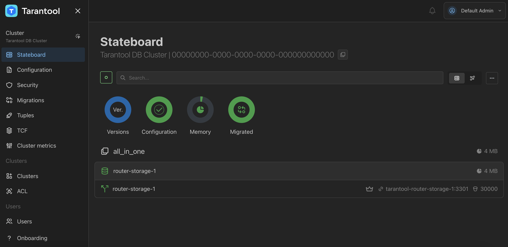

# Запуск кластера из одного узла через Docker Compose

В этом руководстве показано, как развернуть кластер Tarantool DB из одного узла с помощью Docker Compose.
В примере применяется нестандартный способ первоначального запуска модуля [шардирования](https://www.tarantool.io/docs/tdb/ru/3_x/admin_guide/sharding)
— с помощью встроенного модуля.
Этот способ можно включить через конфигурацию кластера:

```yaml
groups:
  all_in_one:
    app:
      module: app.vshard_bootstrapper
```

Содержание:

* [Пререквизиты](#пререквизиты)
* [Запуск стенда](#запуск-стенда)
* [Используемые файлы](#используемые-файлы)
* [Остановка кластера](#остановка-кластера)

## Пререквизиты

Для выполнения примера требуются:

* установленный [Docker-образ](https://www.tarantool.io/docs/tdb/ru/3_x/install_and_upgrade/install/install_docker) Tarantool DB;
* приложение Docker Compose;
* исходные файлы примера `all_in_one`.

>[!NOTE]
>  Есть два способа получить исходные файлы примера:
>  * Репозиторий [github.com/tarantool/tarantooldb-examples](https://github.com/tarantool/tarantooldb-examples/tree/release-3x/master).
>    Пример `all_in_one` расположен в директории `examples/all_in_one`.
>  * Отдельный архив [all_in_one.zip](https://download-directory.github.io/?url=https%3A%2F%2Fgithub.com%2Ftarantool%2Ftarantooldb-examples%2Ftree%2Frelease-3x%2Fmaster%2Fexamples%2Fall_in_one&filename=all_in_one), скачанный из этого репозитория.

## Запуск стенда

Перейдите в директорию примера `all_in_one`:
```shell
cd examples/all_in_one
```

Запустите стенд:
```shell
make start
```

Запущенный стенд состоит из:
- кластера Tarantool DB из одного узла. Этот узел одновременно выполняет роль и роутера, и хранилища;
- кластера etcd из 3 узлов;
- одного узла [Tarantool Cluster Manager](https://www.tarantool.io/docs/tdb/ru/3_x/getting_started#getting_started-tcm) (TCM).

После запуска должны работать все контейнеры, кроме [init_host](../up_with_docker_compose/README.md#контейнер-init_host).

Также после запуска кластера становится доступен веб-интерфейс TCM.
Для входа в TCM откройте в браузере адрес [http://localhost:8081](http://localhost:8081).
Логин и пароль для входа:

- **Username**: `admin`
- **Password**: `secret`

После применения настроек кластер будет выглядеть так:



## Используемые файлы

В руководстве используются следующие файлы примера `all_in_one`:

* `cluster/` — директория с файлами для запуска кластера Tarantool DB:
  * `config.yml` — конфигурация и топология кластера;
  * `docker-compose.yml` — описание узлов кластера Tarantool DB;
  * `migrations/scenario` — директория, содержащая файлы с описанием миграций;
* `tools/` — директория с файлами для запуска кластера etcd и TCM:
  * `docker-compose.yml` — описание узлов кластера etcd;
  * `tcm.yml` — конфигурация для запуска [Tarantool Cluster Manager](https://www.tarantool.io/ru/doc/latest/reference/tooling/tcm/);
* `Makefile` — инструкции для утилиты `make` для запуска и остановки всего стенда.

## Остановка кластера

Остановить кластер можно так:

```shell
make stop
```
