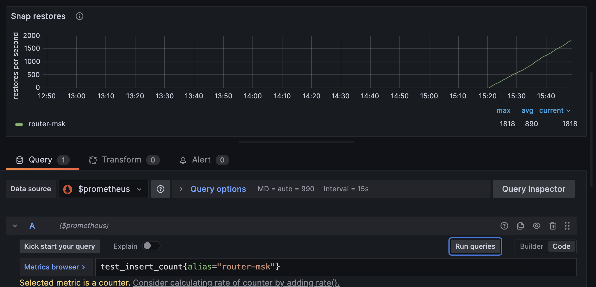
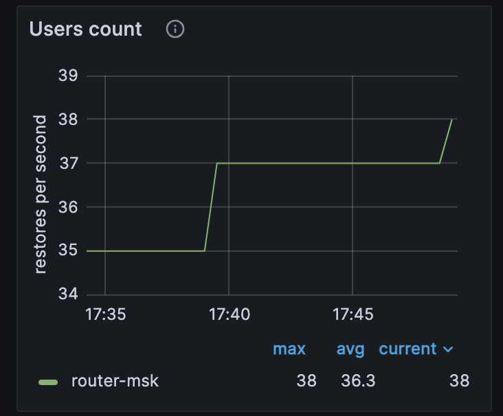

(user_guide-custom_metrics)=
# Пример создания пользовательской метрики

В примере демонстрируется создание произвольной метрики.
Для этого будет использован модуль metrics и пользовательский код на lua.

Для мониторинга используются:

* [Prometheus](https://prometheus.io/) -- сбор и хранение метрик;
* [Grafana](https://grafana.com/) -- визуализация метрик.
Содержание:

* [](user_guide-custom_metrics-prereq)
* [](user_guide-custom_metrics-start_example)
* [](user_guide-custom_metrics-files)
* [](user_guide-custom_metrics-watch_metrics)
* [](user_guide-custom_metrics-stop_example)

(user_guide-sync_replication-prereq)=
## Пререквизиты

Для выполнения примера требуются:

* установленный [Docker-образ](install_docker-image) Tarantool DB;
* приложение Docker Compose;
* Go;
* исходные файлы примера `custom_metrics`.
 
(user_guide-sync_replication-start_example)=
## Запуск стенда

Для успешного запуска должны быть свободны следующие порты:

* 3301..3308
* 8081
* 8088
* 3000

Перейдите в директорию `custom_metrics/tt`:

```shell
cd ./doc/examples/sync_replication/tt
```

Стенд состоит из:
- кластера Tarantool DB:
  - 1 роутера;
  - 1 набора реплик по 3 хранилища;
- кластера etcd из 3 узлов;
- 1 [Tarantool Cluster Manager](getting_started-tcm) (TCM);
- клиентского приложения, подающего нагрузку;
- средств мониторинга -- [Prometheus](https://prometheus.io/), [Grafana](https://grafana.com/).

Запустите всё, кроме клиентского приложения, следующей командой:

```shell
make start
```

После запуска должны работать все контейнеры, кроме [init_host](admin_guide-deploy_docker_compose-init_host).

Также после запуска доступны следующие пользовательские интерфейсы:
* [http://localhost:8081](http://localhost:8081) -- веб-интерфейс TCM;
* [http://localhost:3000](http://localhost:3000) -- веб-интерфейс Grafana.

Для входа в TCM откройте в браузере адрес [http://localhost:8081](http://localhost:8081).
Логин и пароль для входа:

- **Username**: `admin`
- **Password**: `secret`

В TCM откройте вкладку **Stateboard**.

Выберите в наборе реплик `router-msk` узел `router-msk` и в открывшемся окне перейдите на вкладку **Terminal**.
Во вкладке **Terminal** проверьте наличие спейс `test`:

```lua
box.space
```

Спейс `test` должен присутствовать в выводе, он создается при запуске кластера.

(user_guide-custom_metrics-files)=
## Исходные данные

Давайте создадим хранимую процедуру:
```lua
lua_code = [[
function()
    -- Проверяем, была ли переменная уже инициализирована
    if _G.test_insert_count == nil then
        -- Инициализируем переменную только один раз
        _G.test_insert_count = require('metrics').counter('test_insert_count', 'The number of data operations')
    end

    -- Функция для генерации метрики
    local function generate_count(counter)
        local request_type = 'default' -- Убедитесь, что request_type определен
        counter:inc(1, { request_type = request_type })
    end

    -- Вызываем функцию генерации метрики
    generate_count(_G.test_insert_count)
end
]]

box.schema.func.create('counter_task', {
    body = lua_code,
    language = 'LUA',
    if_not_exists = true
})
```
После этого нужно скопировать код выше и вставить его в терминал на роутере. Терминал можно найти если в TCM нажать на роутер и выбрать вкладку **Terminal**.

Далее чтобы вызвать функцию `counter_task` нужно выполнить следующее:
```lua
box.func.counter_task:call()
```
Так мы вызовем хранимую процедуру, которую создали ранее. Ее вызов будет увеличивать значение метрики на `1`.

Больше о работе с метриками вы можете узнать из [документации](https://www.tarantool.io/ru/doc/latest/admin/monitoring/getting_started/#creating-custom-metrics).

```shell
cd ./doc/examples/sync_replication/go
```
(user_guide-custom_metrics-watch_metrics)=
## Просмотр метрики

Перейдем в графану по url `http://127.0.0.1:3000/`

Откроем дашборд Tarantool LuaJit statistics и дублируем любой график, далее нажимаем `Edit`
Вставляем в поле `Metrics broswer` значение  `test_insert_count{alias="router-msk"}`
Должно получится то, что на изображении:

Метрика показывает значение `count`, которое добавляется при каждом  вызове хранимой процедуры.

В итоге вы должны увидеть такую картину:


(user_guide-custom_metrics-stop_example)=
## Остановка стенда

Для остановки стенда:

* В первом локальном терминале вернитесь в директорию `sync_replication/tt`:

  ```shell
  cd ./doc/examples/custom_metrics/tt
  ```

  Выполните следующую команду:

  ```shell
  make stop
  ```

* Во втором локальном терминале выполните команду `Ctrl + Z`.
