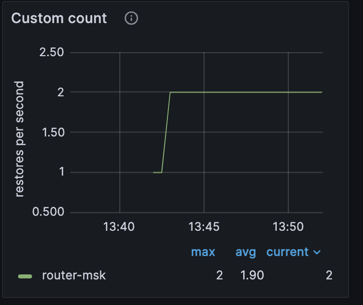

(user_guide-custom_metrics)=
# Пример создания пользовательской метрики

В примере демонстрируется создание произвольной метрики.
Для этого будет использован модуль metrics и пользовательский код на lua.

Для мониторинга используются:

* [Prometheus](https://prometheus.io/) -- сбор и хранение метрик;
* [Grafana](https://grafana.com/) -- визуализация метрик.
Содержание:

* [](user_guide-custom_metrics-prereq)
* [](user_guide-custom_metrics-start_example)
* [](user_guide-custom_metrics-files)
* [](user_guide-custom_metrics-watch_metrics)
* [](user_guide-custom_metrics-stop_example)

(user_guide-sync_replication-prereq)=
## Пререквизиты

Для выполнения примера требуются:

* установленный [Docker-образ](install_docker-image) Tarantool DB;
* приложение Docker Compose;
* Go;
* исходные файлы примера `custom_metrics`.
 
(user_guide-sync_replication-start_example)=
## Запуск стенда

Для успешного запуска должны быть свободны следующие порты:

* 3301..3308
* 8081
* 8088
* 3000

Перейдите в директорию `custom_metrics/tt`:

```shell
cd ./doc/examples/sync_replication/tt
```

Стенд состоит из:
- кластера Tarantool DB:
  - 1 роутера;
  - 1 набора реплик по 3 хранилища;
- кластера etcd из 3 узлов;
- 1 [Tarantool Cluster Manager](getting_started-tcm) (TCM);
- клиентского приложения, подающего нагрузку;
- средств мониторинга -- [Prometheus](https://prometheus.io/), [Grafana](https://grafana.com/).

Запустите всё, кроме клиентского приложения, следующей командой:

```shell
make start
```

После запуска должны работать все контейнеры, кроме [init_host](admin_guide-deploy_docker_compose-init_host).

Также после запуска доступны следующие пользовательские интерфейсы:
* [http://localhost:8081](http://localhost:8081) -- веб-интерфейс TCM;
* [http://localhost:3000](http://localhost:3000) -- веб-интерфейс Grafana.

Для входа в TCM откройте в браузере адрес [http://localhost:8081](http://localhost:8081).
Логин и пароль для входа:

- **Username**: `admin`
- **Password**: `secret`

В TCM откройте вкладку **Stateboard**.


(user_guide-custom_metrics-files)=
## Исходные данные

В коде миграций создана хранимая процедура. 
Миграции можно найти в по пути `doc/examples/custom_metrics/tt/cluster/migrations/scenario/001_test.lua`.

Далее чтобы вызвать функцию `counter_task` нужно перейти в терминал (вкладка **Terminal** на роутере в TCM) выполнить следующее:

```lua
box.func.counter_task:call()
```
Так мы вызовем хранимую процедуру, которую создали ранее. Ее вызов будет увеличивать значение метрики на `1`.

Больше о работе с метриками вы можете узнать из [документации](https://www.tarantool.io/ru/doc/latest/reference/reference_lua/metrics/#metrics-api-reference-custom-metrics).

(user_guide-custom_metrics-watch_metrics)=
## Просмотр метрики

Перейдем в графану по url `http://127.0.0.1:3000/`

Откроем дашборд Cluster Overview. Там в самом низу должен быть график `Custom count`.

После вызова хранимой процедуры значение на графике должно увеличиваться на `1`.
В графике используется выражение `test_insert_count{alias="router-msk"}`, его мы задали в хранимой процедуре.

(user_guide-custom_metrics-stop_example)=
## Остановка стенда

Для остановки стенда выполните следующую команду:

  ```shell
  make stop
  ```
