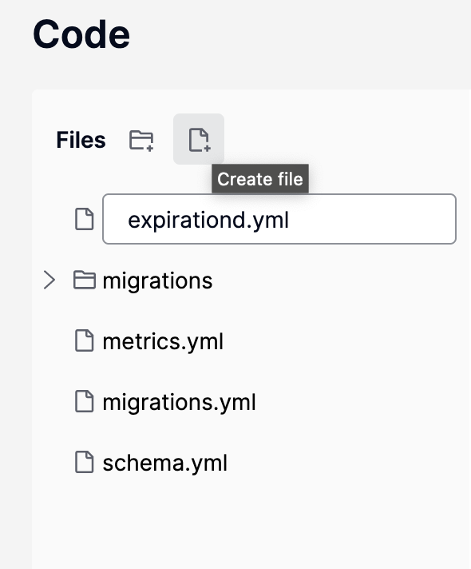
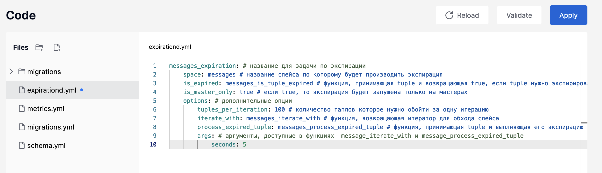

(user_guide-expirationd)=
# Устаревание данных

Модуль [`expirationd`](https://github.com/tarantool/expirationd) позволяет контролировать время жизни кортежей в спейсе и
обрабатывать кортежи, время жизни которых истекло.

Модуль работает в фоновом режиме в рамках одного спейса:
- обходит спейс по индексу с заданной периодичностью;
- проверяет срок жизни кортежа с помощью функции `is_expired`;
- применяет к кортежу функцию `process_expired_tuple`, заданную пользователем.

В Tarantool DB модуль доступен в виде технологической роли [expirationd](reference-roles-expirationd).

```{admonition} Важно
:class: warning

Персистентные функции, которые нужны для работы модуля, нужно объявить перед применением конфигурации для роли `expirationd`.
Это означает, что сначала применяют миграции с функциями, а затем включают роли. 
```

В этом руководстве описано, как включить роль `expirationd` и настроить параметры устаревания данных в конфигурации,
чтобы удалять все кортежи в спейсе, которые старше заданного времени.

Руководство включает следующие шаги:

* [](user_guide-expirationd-prereq)
* [](user_guide-expirationd-start_example)
* [](user_guide-expirationd-migration)
* [](user_guide-expirationd-add_data)
* [](user_guide-expirationd-config)
* [](user_guide-expirationd-functions)
* [](user_guide-expirationd-stop_example)

(user_guide-expirationd-prereq)=
## Пререквизиты

Для выполнения примера требуются:
* установленный [Docker-образ](/install_and_upgrade/install/install_docker.md) Tarantool DB;
* приложение Docker compose;
* утилита [TT CLI](install-install_tt);
* исходные файлы примера `expirationd`.

  ```{admonition} Примечание
  :class: note

  Есть два способа получить исходные файлы примера:

  * Архив с полной документацией Tarantool DB, полученный по почте или скачанный в [личном кабинете tarantool.io](https://www.tarantool.io/en/accounts/customer_zone/packages/tarantooldb/release/documentation).
    Пример архива: `tarantooldb-documentation-1.0.0.tar.gz`.
    Пример `expirationd` расположен в таком архиве в директории `./doc/examples/expirationd/`.
    
  * Отдельный архив [expirationd.tar.gz](https://tarantool.io/ru/tarantooldb/doc/1.x/examples/expirationd/expirationd.tar.gz), скачанный c сайта Tarantool.
  ```
  
(user_guide-expirationd-start_example)=
## Запуск кластера и подключение к узлу

Для успешного запуска кластера должны быть свободны следующие порты:

* 3300 .. 3304
* 8080 .. 8084

Перейдите в папку с примером `expirationd` и запустите кластер:

``` shell
cd ./doc/examples/expirationd/
docker compose up -d
```

Подключитесь к экземпляру, используя команду `tt connect`.
Команда открывает интерактивную консоль Tarantool, позволяющую работать с базой данных:

``tt connect admin:secret-cluster-cookie@localhost:3300``

(user_guide-expirationd-migration)=
## Описание миграции

В руководстве используется миграция из файла `./bootstrap/migrations/source/001_test.lua` примера `expirationd`.
В этой миграции:
- создан спейс `messages`;
- созданы персистентные функции с логикой устаревания данных -- `messages_is_tuple_expired`, `messages_iterate_with`, `messages_process_expired_tuple`;
- созданы тестовые функции для генерации данных -- `__start_messages_stream`, `__stop_messages_stream`.

В примере создан спейс `messages` со следующим форматом:

```{literalinclude} bootstrap/migrations/source/001_test.lua
:start-after: -- создание спейса messages
:end-before: utils.register_sharding_key
:language: lua
:dedent:
```

Необходимо удалять все записи в спейсе старше заданного количества секунд. Количество секунд задается в конфигурации.

(user_guide-expirationd-add_data)=
## Загрузка тестовых данных

Для демонстрации работы модуля `expirationd` используются следующие функции:

* `__start_messages_stream` -- запуск фоновой записи тестовых данных в спейс `messages`;
* `__stops_messages_stream` -- остановка фоновой записи тестовых данных в спейс.

После подключения к узлу добавьте тестовые данные, вызвав функцию `_start_messages_stream`:

```lua
localhost:3300> box.schema.func.call('__start_messages_stream')
```

Для примера достаточно 100-200 записей в спейсе.
Посмотреть количество записей можно с помощью модуля [space-explorer](http://localhost:8081/admin/space-explorer/hosts).

После отключите генерацию данных с помощью функции `_stop_messages_stream`:

```lua
localhost:3300> box.schema.func.call('__stop_messages_stream')
```

(user_guide-expirationd-config)=
## Конфигурация устаревания данных

Включите роль `expirationd` на хранилищах. Это можно сделать двумя способами:

* в терминале с помощью следующей команды:

  ```bash
  curl -sd @activate_expirationd.json http://localhost:8081/admin/api | jq
  ```
* в веб-интерфейсе во вкладке **Cluster** открыть окно редактирования хранилищ (**Edit replica set**) и выбрать эту роль в секции **Roles**.

Теперь задайте конфигурацию для `expirationd`.
Сделать это можно через веб-интерфейс Tarantool DB по адресу [http://localhost:8081/admin/cluster/code](http://localhost:8081/admin/cluster/code):

1. В веб-интерфейсе Tarantool DB перейдите на вкладку **Code**.
2. Создайте файл `expiration.yml`. В нем будет задана конфигурация устаревания данных.

    

3. Добавьте в файл следующую конфигурацию:
   
    ```yaml
    messages_expiration:
        space: messages
        is_expired: messages_is_tuple_expired
        is_master_only: true
        options:
            tuples_per_iteration: 100
            iterate_with: messages_iterate_with
            process_expired_tuple: messages_process_expired_tuple
            args:
                seconds: 5
    ```

    Здесь:
    
    * `messages_expiration` -- название задачи по устареванию данных;
      * `space` -- название спейса, по которому идет поиск устаревших кортежей;
      * `is_expired` -- название функции, которая получает кортеж и проверяет его срок жизни;
      * `is_master_only` -- экспирация запущена только на master-узлах;
      * `options` -- дополнительные опции конфигурации:
        * `tuples_per_iteration` -- количество кортежей, которое проверяется за одну итерацию;
        * `iterate_with` -- название функции, которая получает и обрабатывает устаревшие кортежи;
        * `process_expired_tuple` -- название функции, возвращающей итератор для обхода спейса;
        * `args` -- аргументы, доступные в функциях `message_iterate_with` и `message_process_expired_tuple`, `seconds` --
          время жизни кортежа.
    
    Полное описание опций конфигурации `expirationd` приведено в соответствующем разделе [Cправочника по конфигурации](configuration_reference-expirationd).

4. Нажмите кнопку **Apply**:

   

Согласно этой конфигурации, задачи по устареванию данных `messages_expiration` выполняются так:

1. Запускается файбер для фоновой экспирации спейса `messages`.
2. Файбер обходит спейс `messages` по итератору из функции `messages_iterate_with`.
   Функция `messages_iterate_with` выглядит так:

   ```lua
   -- options из конфигурации для messages_expiration
   function(options)
       local datetime = require('datetime')
       -- создан интервал с помощью аргументов из конфигурации
       local int = datetime.interval.new({ sec = options.args.seconds or 60 }) 
       -- возвращен необходимый итератор
       -- обход по индексу `create_date` с началом от текущего момента минус заданный интервал
       -- если iterator_type == LE, то будут удаляться все записи, созданные более чем `options.args.seconds` секунд назад
       return box.space.messages.index.create_date:pairs({ datetime.now() - int }, { iterator = 'LE' })
   end
   ```
   
3. Срок жизни каждого кортежа проверяется с помощью булевой функции `messages_is_tuple_expired`.
   Значение `true` означает, что срок жизни кортежа истек.
4. Такой кортеж передается в функцию `messages_process_expired_tuple`, которая удалит этот кортеж:

   ```lua
    function(space, args, tuple)
        box.space[space]:delete({tuple.id})
    end
    ```

После применения конфигурации можно увидеть, что сгенерированные ранее данные были удалены.
Подключитесь снова к узлу кластера:

```shell
tt connect admin:secret-cluster-cookie@localhost:3300
```

Запустите еще раз генерацию данных уже с включенным устареванием данных:

```lua
localhost:3300> box.schema.func.call('__start_messages_stream')
```

Если открыть в веб-интерфейсе ([http://localhost:8081/admin/space-explorer/hosts](http://localhost:8081/admin/space-explorer/hosts)) во вкладке **Space explorer** произвольное хранилище
и обновлять страницу браузера, видно, что количество записей в спейсе не растет, а также периодически уменьшается.
Это означает, что все записи старше 5 секунд удаляются.

(user_guide-expirationd-functions)=
## Функции для экспирации и конфигурация expirationd

В функции для обработки устаревших кортежей (`process_expired_tuple`) можно не только удалять, но и выполнять любые
другие операции, в том числе операции по сети.
При этом, чем быстрее работает функция `process_expired_tuple`, тем меньше вероятность, что ее работа отразится на общей производительности экземпляра.

Если на экземпляре с ролью `expirationd` нет функций, заданных в конфигурации, конфигурация применена не будет.
Поскольку миграции будут выполнена после применения конфигурации для роли `expirationd`,
при начальном развертывании это может привести к ошибке `OperationError`.

Чтобы избежать этого, создайте функции на экземпляре перед этими шагами:
- на экземпляре активирована роль `expirationd` в случае, если конфиг с функциями уже применен. Такая ситуация возможна при расширении кластера.
- применен конфиг для `expirationd`.

(user_guide-expirationd-stop_example)=
## Остановка кластера

Чтобы остановить кластер, выполните следующую команду:

```shell
docker compose down
```

