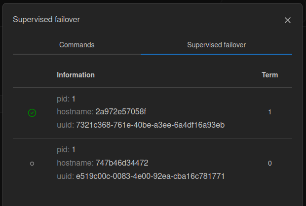

(admin_guide-failover_coordinator)=
# Использование координаторов отказоустойчивости

В этом руководстве показано, как настроить работу 
[внешних координаторов отказоустойчивости](https://www.tarantool.io/en/doc/latest/platform/replication/supervised_failover/#repl-supervised-failover)
(*supervised failover coordinators*).


Содержание:

* [](admin_guide-failover_coordinator-prereq)
* [](admin_guide-failover_coordinator-start_example)
* [](admin_guide-failover_coordinator-healthcheck)
* [](admin_guide-failover_coordinator-stop_example)

(admin_guide-failover_coordinator-prereq)=
## Пререквизиты

Для выполнения примера требуются:

* установленные [Docker-образы](install_docker-image) Tarantool DB, Prometheus и Grafana;
* приложение Docker Compose;
* исходные файлы примера `failover_coordinator`.

  ```{admonition} Примечание
  :class: note

  Есть два способа получить исходные файлы примера:

  * Архив с полной документацией Tarantool DB, полученный по почте или скачанный в [личном кабинете tarantool.io](https://www.tarantool.io/en/accounts/customer_zone/packages/tarantooldb/release/documentation).
    Пример архива: `tarantooldb-documentation-2.0.0.tar.gz`.
    Пример `failover_coordinator` расположен в таком архиве в директории `./doc/examples/failover_coordinator/`.
    
  * Отдельный архив [failover_coordinator.tar.gz](https://tarantool.io/ru/tarantooldb/doc/latest/examples/failover_coordinator/failover_coordinator.tar.gz), скачанный c сайта Tarantool.
  ```

(admin_guide-failover_coordinator-start_example)=
## Запуск стенда

Перейдите в директорию примера `failover_coordinator`:

```shell
cd ./doc/examples/failover_coordinator/
```

Запустите кластер Tarantool DB:

```shell
make start
```

Команда последовательно выполняет следующие шаги:
1. Запускает централизованное хранилище конфигурации -- кластер etcd;
2. Загружает конфигурацию кластера в централизованное хранилище;
3. Запускает кластер Tarantool DB;
4. Загружает миграции в кластер и выполняет их.

Запущенный стенд состоит из:

- кластера Tarantool DB:
  - 2 роутера;
  - 2 набора реплик по 3 хранилища;
  - 2 координатора отказоустойчивости;
  - 1 [Tarantool Cluster Manager](getting_started-tcm) (TCM);
- кластера etcd из 3 узлов;
- средств мониторинга ([Prometheus](https://prometheus.io/), [Grafana](https://grafana.com/)).

После запуска должны работать все контейнеры, кроме [init_host](admin_guide-deploy_docker_compose-init_host).

Также после запуска доступны следующие пользовательские интерфейсы:
* http://localhost:8081 -- веб-интерфейс TCM;
* http://localhost:9090 -- веб-интерфейс Prometheus;
* http://localhost:3000 -- веб-интерфейс Grafana.

Для входа в веб-интерфейс TCM откройте в браузере адрес [http://localhost:8081](http://localhost:8081).
Логин и пароль для входа:

- **Username**: `admin`
- **Password**: `secret`

В TCM откройте вкладку **Stateboard**.
После применения настроек кластер будет выглядеть так:


На вкладке **Stateboard** вызовите меню **Actions** кластера, нажав на кнопку `...` справа от строки поиска. В меню выберите
пункт **Supervised failover**. Откроется окно, в котором на вкладке
**Supervised failover** отображаются все работающие координаторы
кластера. Активный координатор отмечен в этом списке зелёной галочкой.



(admin_guide-failover_coordinator-healthcheck)=
## Проверка работы

В TCM перейдите на вкладку **Stateboard**.
Нажмите на набор реплик `router-msk`.
Выберите роутер `router-msk` и в открывшемся окне перейдите на вкладку **Terminal**.

Во вкладке **Terminal** введите следующую команду, чтобы добавить в спейс новый кортеж:
```lua
crud.insert_object('bands', {id = 1, band_name = 'Free Flow Flava', year = 2014})
```

После этого проверьте записанный кортеж с помощью операции `crud.select()`:
```lua
crud.select('bands').rows
```

Теперь нужно остановить мастер-узлы. Чтобы определить мастер-узлы в наборе реплик, в TCM на вкладке **Stateboard** найдите в каждом наборе реплик экземпляр кластера с иконкой короны. В данном примере это узлы `storage-1-brn`
и `storage-2-brn`.

Чтобы остановить эти экземпляры кластера, вернитесь в терминал ОС и выполните следующие команды:
```shell
cd cluster/
docker compose stop tarantool-<имя_первого_мастера>
docker compose stop tarantool-<имя_второго_мастера>
cd ..
```

Видно, что мастер-узлы стали недоступны, а их лидерство передано другим эклемплярам.

В TCM перейдите на вкладку **Stateboard**.
Нажмите на набор реплик `router-msk`.
Выберите роутер `router-msk` и в открывшемся окне перейдите на вкладку **Terminal**.
Во вкладке **Terminal** введите следующую команду, чтобы добавить в спейс новый кортеж:

```lua
crud.insert_object('bands', {id = 2, band_name = 'Wax Tailor', year = 2001})
```

Кластер доступен для записи данных. Проверить кортеж, добавленный в спейс, можно так:
```lua
crud.select('bands').rows
```

(admin_guide-failover_coordinator-stop_example)=
## Остановка стенда

Остановить стенд можно так:

```shell
make stop
```
