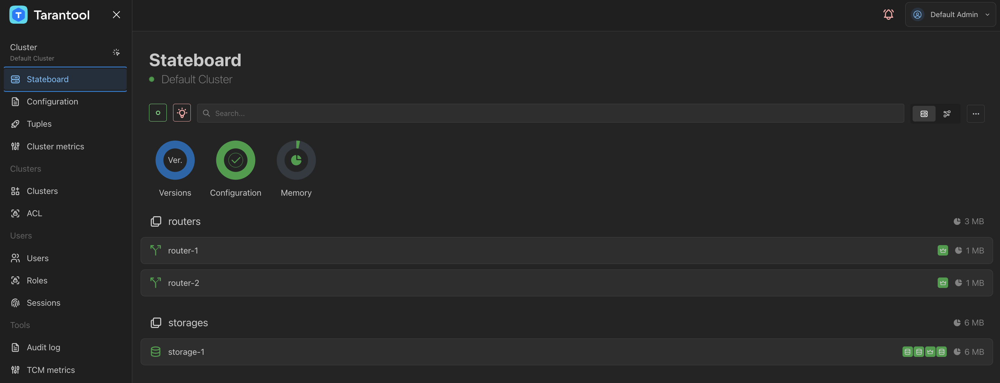

# Балансировка запросов к роутерам через Go-коннектор

В примере демонстрируется работа с повреждённым кластером под нагрузкой.
Приложение непрерывно записывает кортежи пачками через все роутеры по очереди.
Для записи используется операция `replace`.
Если какой-либо роутер упал, трафик с него переключается на остальные роутеры.
Если роутер поднялся, трафик на него возвращается.

Для мониторинга используются:

* Prometheus -- сбор и хранение метрик;
* Grafana -- визуализация метрик.

```{admonition} Примечание
:class: note

Пример стенда с Telegraf и InfluxDB приведен в разделе [Балансировщик запросов к роутерам через Go-коннектор](/examples/java_balancer/connectors_java_balancer.md).
```

Содержание:

* [](user_guide-go_balancer-prereq)
* [](user_guide-go_balancer-start_example)
* [](user_guide-go_balancer-grafana)
* [](user_guide-go_balancer-increase_load)
* [](user_guide-go_balancer-stop_router)
* [](user_guide-go_balancer-start_router)
* [](user_guide-go_balancer-stop_example)

(user_guide-go_balancer-prereq)=
## Пререквизиты

Для выполнения примера требуются:

* установленный [Docker-образ](/install_and_upgrade/install/install_docker.md) Tarantool DB;
* приложение Docker compose;
* Go;
* исходные файлы примера `go_balancer`.

  ```{admonition} Примечание
  :class: note

  Есть два способа получить исходные файлы примера:

  * Архив с полной документацией Tarantool DB, полученный по почте или скачанный в [личном кабинете tarantool.io](https://www.tarantool.io/en/accounts/customer_zone/packages/tarantooldb/release/documentation).
    Пример архива: `tarantooldb-documentation-2.0.0.tar.gz`.
    Пример `go_balancer` расположен в таком архиве в директории `./doc/examples/go_balancer/`.
    
  * Отдельный архив [go_balancer.tar.gz](https://tarantool.io/ru/tarantooldb/doc/latest/examples/go_balancer/go_balancer.tar.gz), скачанный c сайта Tarantool.
  ```
 
(user_guide-go_balancer-start_example)=
## Запуск стенда

Для успешного запуска должны быть свободны следующие порты:

* 3301--3306
* 8081
* 3000


Перейдите в директорию `go_balancer/tt`:

```shell
cd ./doc/examples/go_balancer/tt
```

Запустите стенд:

```shell
docker compose up -d
```

Команда развернет стенд, состоящий из:
* кластера Tarantool DB (2 роутера, 4 хранилища, 1 TCM);
* клиентского приложения, подающего нагрузку;
* средств мониторинга (Prometheus, Grafana).

После запуска должны работать все контейнеры. Также
после запуска доступны следующие пользовательские интерфейсы:
* http://localhost:8081 -- веб-интерфейс кластера Tarantool DB ([TCM](https://www.tarantool.io/ru/doc/latest/reference/tooling/tcm/));
* http://localhost:3000 -- веб-интерфейс Grafana.

Получите пароль для входа в веб-интерфейс Tarantool DB:
```shell
docker compose logs tcm-1 | grep "super admin"
```

Откройте веб-интерфейс в браузере по адресу [http://localhost:8081](http://localhost:8081).
Для входа используйте логин `admin` и пароль, полученный с помощью предыдущей команды.

Чтобы настроить кластер:

1. В веб-интерфейсе перейдите на вкладку **Clusters**.
2. В строке с кластером `Default cluster` нажмите кнопку **...** (**Actions**) справа и выберите **Edit** в выпадающем меню.
3. Переключитесь на второй экран настройки, используя кнопку **Next**.
4. На втором экране укажите в поле **Prefix** значение `/tdb` и нажмите  **Next**.
5. На третьем экране укажите следующие значения:
   - в поле **Username** -- `admin`;
   - в поле **Password** --  `secret-cluster-cookie`.
    
6. Нажмите **Update**, чтобы сохранить новые настройки кластера. При успешном обновлении в веб-интерфейсе появится сообщение `Cluster updated successfully`.
7. В веб-интерфейсе перейдите на вкладку **Stateboard**. После применения настроек кластер будет выглядеть так:

   

8. Выберите любой роутер из списка (например, `router-1`) и в открывшемся окне перейдите на вкладку **Terminal**.
9. В терминале введите команду `box.space`. Проверьте, что в выводе есть спейс `test` -- этот спейс создается при запуске кластера.

(user_guide-go_balancer-grafana)=
## Панель Grafana

Откройте в Grafana панель
[Tarantool dashboard](http://localhost:8080/dashboards).
Проверьте, что графики показывают данные за последние 5 минут, а частота обновления равна 5 секундам:


В панели `Tarantool Network activity` откройте график `Processed requests`:


Выделите роутеры. Есть два способа это сделать:

* Нажмите на название `router-1` и, зажав `Shift`, нажмите на `router-2`.
* Используйте переключатель сверху, чтобы выбрать роутеры на уровне всего дашборда:


В панели `Tarantool operations statistics` откройте график `REPLACE space requests`.
Выберите все узлы, кроме роутеров:


В панели `CRUD module statistics"` откройте график `REPLACE success requests`:


(user_guide-go_balancer-increase_load)=
## Увеличение нагрузки

Откройте вторую вкладку терминала.
В этой вкладке перейдите в директорию `go_balancer/go`:

```shell
cd ./doc/examples/go_balancer/go
```

Запустите клиентское приложение:

```shell
go run -tags go_tarantool_ssl_disable main.go
```

Здесь:

* `go_tarantool_ssl_disable` -- опция, отключающая поддержку TLS.
  Так как для поддержки TLS требуется установленный OpenSSL 3.x, для простоты в примере поддержка TLS отключена.

На графиках теперь заметно, что нагрузка растет:
* растет число обработанных запросов на роутерах:

  

* растет число операций `replace` в единицу времени:

  

Включите отображение графиков хранилищ и оцените их:


В веб-интерфейсе Tarantool DB откройте вкладку **Space Explorer** и проверьте, что в хранилищах появились данные.

(user_guide-go_balancer-stop_router)=
## Имитация отказа роутера

Чтобы имитировать отказ роутера, в первом терминале выполните команду:
```shell
docker compose stop tarantool-router-1
```

Теперь в веб-интерфейсе Tarantool DB во вкладке **Cluster** узел `tarantool-router1` помечается как нездоровый (`unhealthy`).
График запросов изменится так:


Нагрузка на второй роутер увеличилась вдвое.
График для второго роутера выглядит так:


Роста нагрузки на этом графике нет.
График прерывается, так как роутер не работает и метрики с него не поступают.
Количество операций `replace` при этом не изменилось:


Кол-во операций `crud-replace` на рабочем роутере возросло:


(user_guide-go_balancer-start_router)=
## Восстановление роутера

Для запуска первого роутера выполните следующую команду:

```shell
docker compose start tarantool-router-1
```

В веб-интерфейсе Tarantool DB во вкладке **Cluster** видно, что узел `tarantool-router1` восстановлен.
Нагрузка на второй роутер уменьшилась вдвое, появились данные по нагрузке с первого:


Число операций `replace` не изменилось:


Кол-во операций `crud-replace` на один роутер снизилось:


(user_guide-go_balancer-stop_example)=
## Остановка стенда

Для остановки стенда:

* В первом терминале выполните команду:

    ```shell
    docker compose down
    ```
  
* Во втором терминале выполните команду `Ctrl + Z`.
