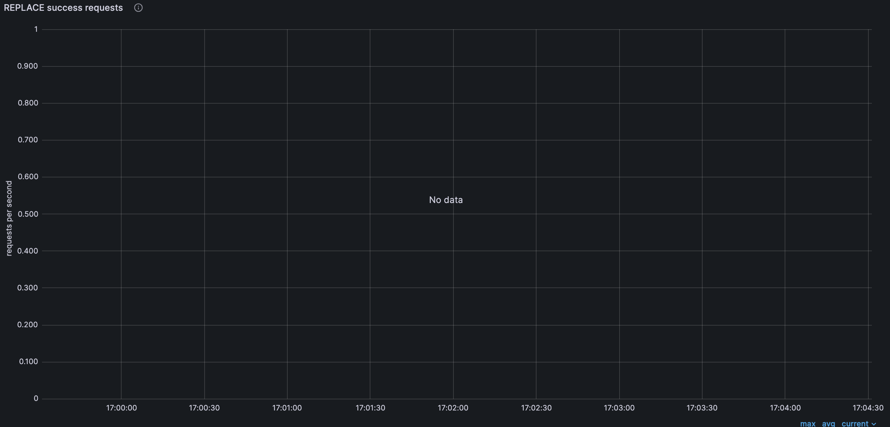
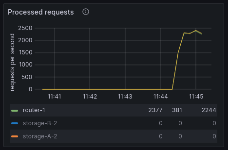
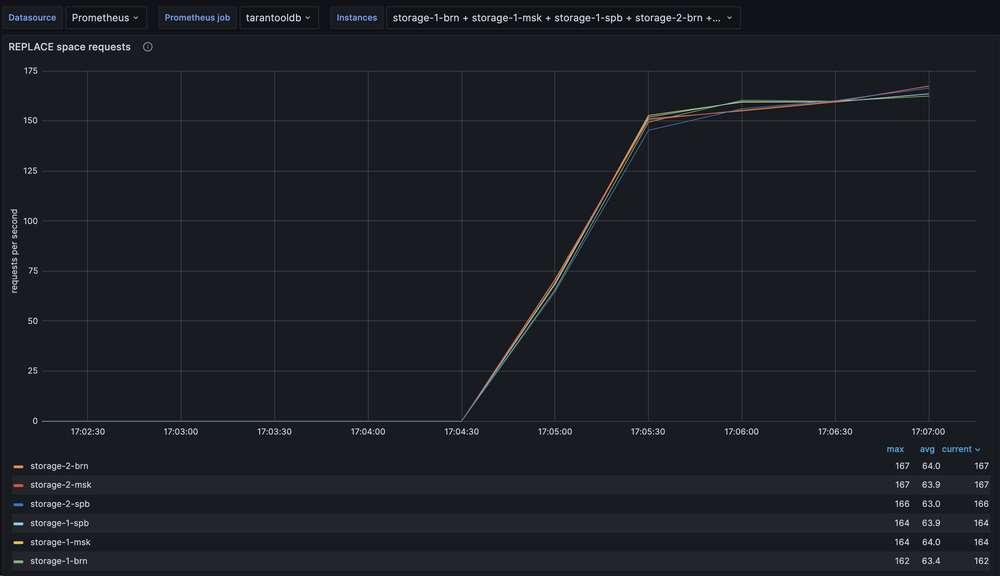
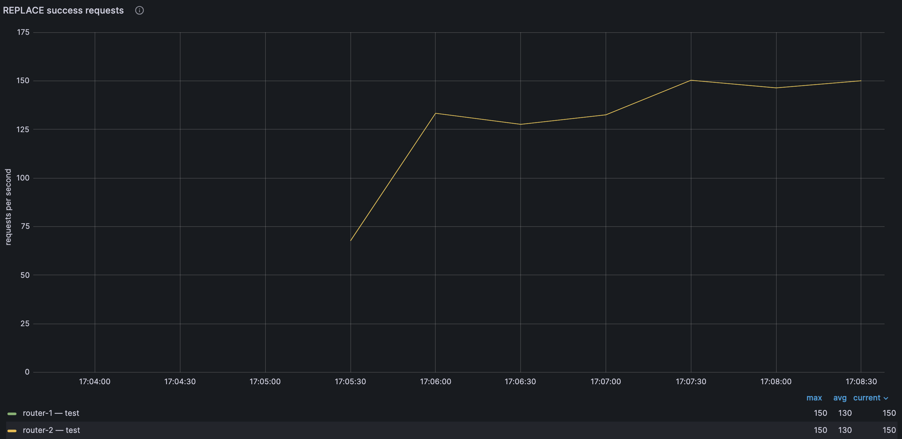
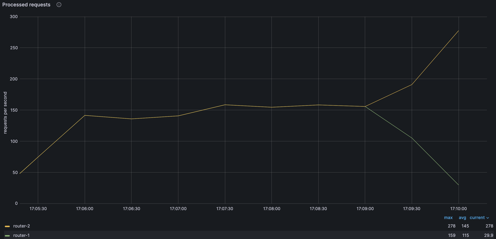
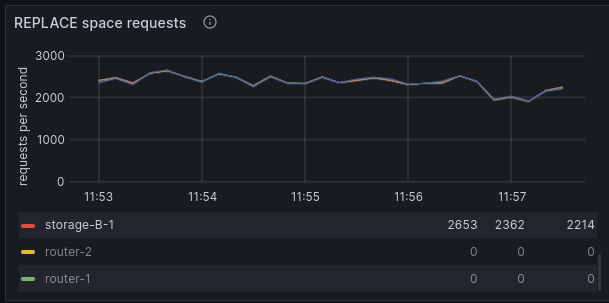
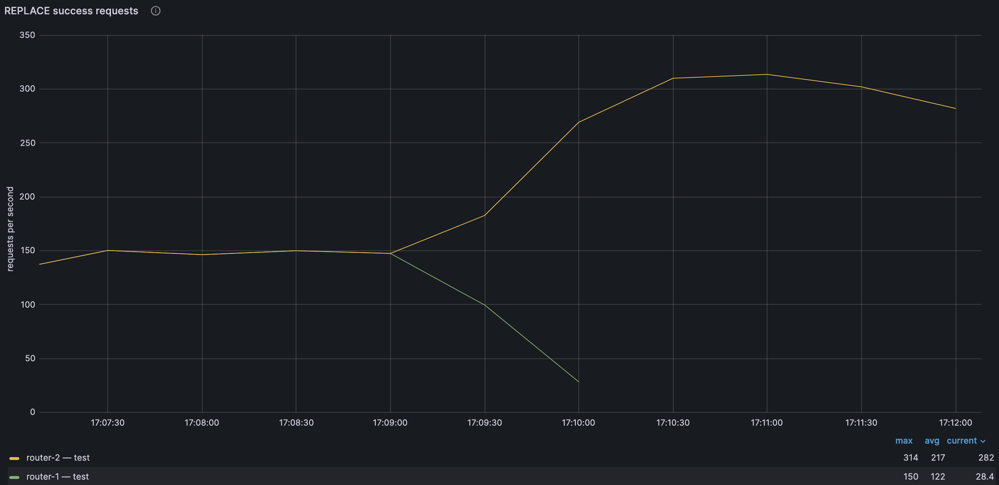
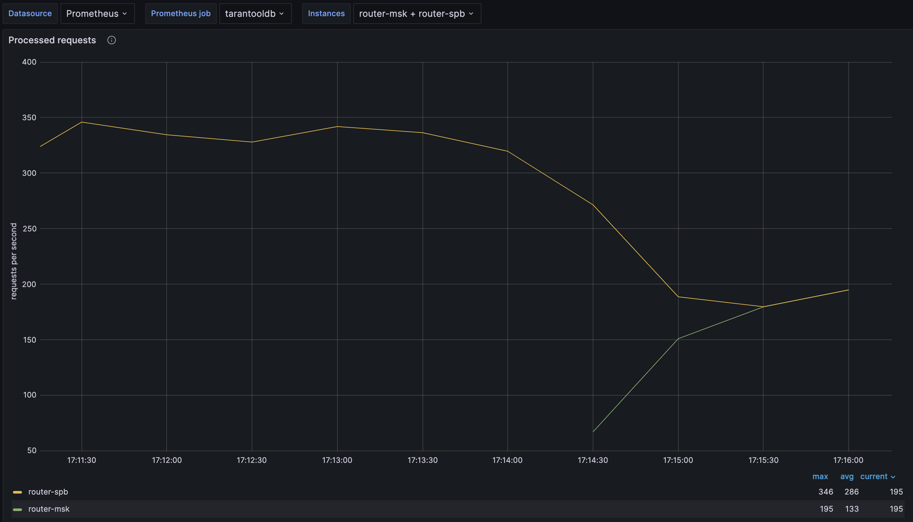
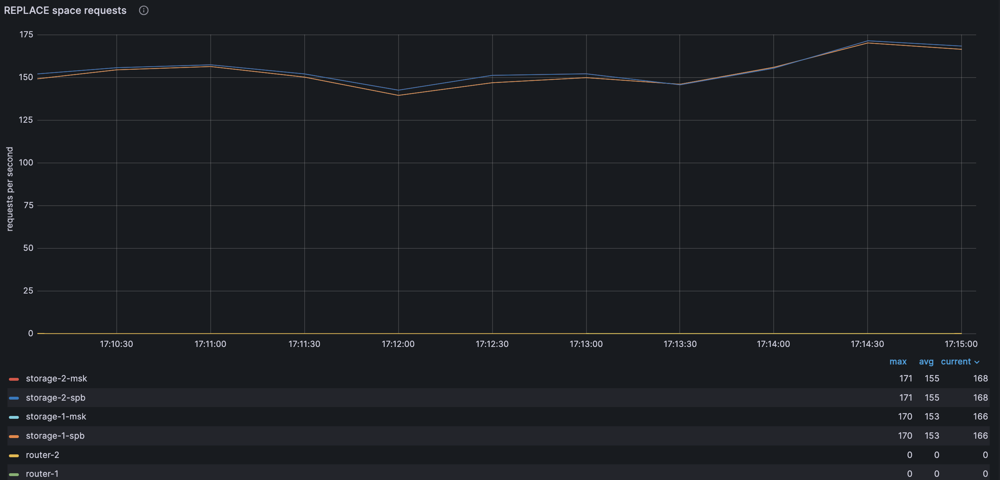
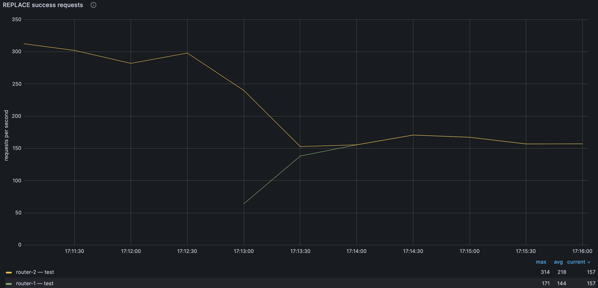

(connectors-go_balancer)=
# Балансировка запросов к роутерам через Go-коннектор

В примере демонстрируется работа с повреждённым кластером под нагрузкой.
Приложение непрерывно записывает кортежи пачками через все роутеры по очереди.
Для записи используется операция `replace`.
Если какой-либо роутер стал недоступен, трафик с него переключается на другие роутеры. 
Если роутер снова стал доступен, трафик на него возвращается.

Для мониторинга используются:

* [Prometheus](https://prometheus.io/) -- сбор и хранение метрик;
* [Grafana](https://grafana.com/) -- визуализация метрик.

```{admonition} Примечание
:class: note

Пример стенда с [Telegraf](https://www.influxdata.com/time-series-platform/telegraf/) и [InfluxDB](https://www.influxdata.com/)
приведен в разделе [Балансировщик запросов к роутерам через Java-коннектор](connectors-java_balancer).
```

Содержание:

* [](user_guide-go_balancer-prereq)
* [](user_guide-go_balancer-start_example)
* [](user_guide-go_balancer-grafana)
* [](user_guide-go_balancer-increase_load)
* [](user_guide-go_balancer-stop_router)
* [](user_guide-go_balancer-start_router)
* [](user_guide-go_balancer-stop_example)

(user_guide-go_balancer-prereq)=
## Пререквизиты

Для выполнения примера требуются:

* установленные [Docker-образы](install_docker-image) Tarantool DB, Prometheus и Grafana;
* приложение Docker Compose;
* Go;
* исходные файлы примера `go_balancer`.

  ```{admonition} Примечание
  :class: note

  Есть два способа получить исходные файлы примера:

  * Архив с полной документацией Tarantool DB, полученный по почте или скачанный в [личном кабинете tarantool.io](https://www.tarantool.io/en/accounts/customer_zone/packages/tarantooldb/release/documentation).
    Пример архива: `tarantooldb-documentation-3.0.0.tar.gz`.
    Пример `go_balancer` расположен в таком архиве в директории `./doc/examples/go_balancer/`.
    
  * Отдельный архив [go_balancer.tar.gz](https://tarantool.io/ru/tarantooldb/doc/latest/examples/go_balancer/go_balancer.tar.gz), скачанный c сайта Tarantool.
  ```
 
(user_guide-go_balancer-start_example)=
## Запуск стенда

Для успешного запуска должны быть свободны следующие порты:

* 2379
* 3000
* 3301--3308
* 8081
* 9090

Перейдите в директорию `go_balancer/tt`:

```shell
cd ./doc/examples/go_balancer/tt
```

Стенд состоит из:
- кластера Tarantool DB:
  - 2 роутера;
  - 2 набора реплик по 3 хранилища;
- кластера etcd из 3 узлов;
- 1 [Tarantool Cluster Manager](getting_started-tcm) (TCM);
- клиентского приложения, подающего нагрузку;
- средств мониторинга -- [Prometheus](https://prometheus.io/), [Grafana](https://grafana.com/).

Запустите всё, кроме клиентского приложения, следующей командой:

```shell
make start
```

После запуска должны работать все контейнеры, кроме [init_host](admin_guide-deploy_docker_compose-init_host).

Также после запуска доступны следующие пользовательские интерфейсы:
* [http://localhost:8081](http://localhost:8081) -- веб-интерфейс TCM;
* [http://localhost:3000](http://localhost:3000) -- веб-интерфейс Grafana.

Для входа в TCM откройте в браузере адрес [http://localhost:8081](http://localhost:8081).
Логин и пароль для входа:

- **Username**: `admin`
- **Password**: `secret`

В TCM откройте вкладку **Stateboard**.
После применения настроек кластер будет выглядеть так:


Выберите в наборе реплик `router-msk` узел `router-msk` и в открывшемся окне перейдите на вкладку **Terminal**.
Во вкладке **Terminal** проверьте наличие спейса `test`:

```lua
box.space
```

Спейс `test` должен присутствовать в выводе, он создается при запуске кластера.

(user_guide-go_balancer-grafana)=
## Панель Grafana

Откройте в браузере веб-интерфейс Grafana по адресу [http://localhost:3000/dashboards](http://localhost:3000/dashboards).
В списке **Dashboards** откройте папку **General** и выберите панель **Tarantool DB dashboard** в выпадающем списке.
Проверьте, что графики показывают данные за последние 5 минут, а частота обновления равна 5 секундам:


Разверните панель **Tarantool network activity** и откройте график **Processed requests**.
Чтобы развернуть график на полный экран, нажмите на графике кнопку **...** (**Menu**) в правом верхнем углу и нажмите в выпадающем меню
кнопку **View**.
Выберите роутеры на графике, используя один из способов ниже:

* Нажмите на название `router-msk` и, зажав `Shift`, нажмите на `router-spb`.
* Используйте переключатель сверху (**Instances**), чтобы выбрать роутеры на уровне всего дашборда.


После перейдите на панель **Tarantool operations statistics** и откройте график **REPLACE space requests**.
Выберите все узлы, кроме роутеров:


Затем перейдите на панель **CRUD module statistics** и откройте график **REPLACE success requests**:



(user_guide-go_balancer-increase_load)=
## Увеличение нагрузки

Откройте вторую вкладку локального терминала.
В этой вкладке перейдите в директорию `go_balancer/go`:

```shell
cd ./doc/examples/go_balancer/go
```

Запустите клиентское приложение:

```shell
go run -tags go_tarantool_ssl_disable main.go
```

Здесь:

* `go_tarantool_ssl_disable` -- опция, отключающая поддержку TLS.
  Так как для поддержки TLS требуется установленный OpenSSL 3.x, для простоты в примере поддержка TLS отключена.

На графиках теперь заметна растущая нагрузка:

* растет число обработанных запросов на роутерах:

  

* растет число операций `replace` в единицу времени:

  

Включите отображение графиков роутеров и оцените их:



Проверьте, что в спейсе `test` появились данные.
Для этого в веб-интерфейсе TCM перейдите на вкладку **Tuples** и выберите в списке спейс `test`.
Откроется новая вкладка с содержимым кортежей спейса `test`.

(user_guide-go_balancer-stop_router)=
## Имитация отказа роутера

В первом терминале перейдите в директорию `cluster`:

```shell
cd cluster
```

Чтобы имитировать отказ роутера, выполните следующую команду:

```shell
docker compose stop tarantool-router-msk
```

Теперь в TCM во вкладке **Stateboard** узел `router-msk` помечается как нездоровый (`unhealthy`).
График запросов изменится так:



Нагрузка на второй роутер увеличилась вдвое.
График для второго роутера выглядит так:


Роста нагрузки на этом графике нет.
График прерывается, так как роутер не работает и метрики с него не поступают.
Количество операций `replace` при этом не изменилось:



Кол-во операций `crud-replace` на рабочем роутере возросло:



(user_guide-go_balancer-start_router)=
## Восстановление роутера

Для запуска первого роутера выполните следующую команду в директории `cluster`:

```shell
docker compose start tarantool-router-msk
```

В TCM во вкладке **Stateboard** видно, что узел `router-msk` восстановлен.
Нагрузка на второй роутер уменьшилась вдвое, появились данные по нагрузке с первого:



Число операций `replace` не изменилось:



Кол-во операций `crud-replace` на один роутер снизилось:



(user_guide-go_balancer-stop_example)=
## Остановка стенда

Для остановки стенда:

* В первом локальном терминале вернитесь в директорию `go_balancer/tt`:

  ```shell
  cd ./doc/examples/go_balancer/tt
  ```

  Выполните следующую команду:

  ```shell
  make stop
  ```

* Во втором локальном терминале выполните команду `Ctrl + Z`.
