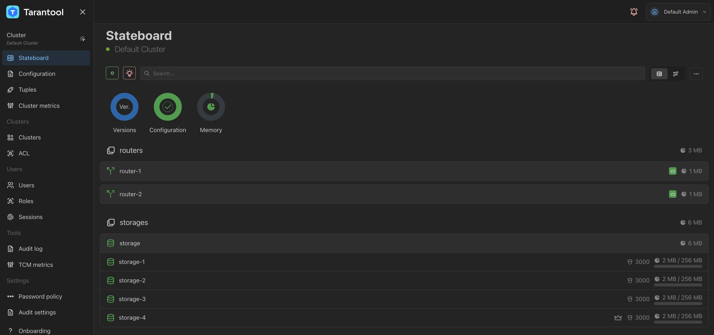

# Работа с кластером Tarantool DB через модуль CRUD с помощью Go-коннектора

В примере приложение записывает кортежи в спейс пачками через выбранный роутер, а также выполняет чтение.
Для взаимодействия в целях универсальности используется тип `interface{}`. Это означает, что значения после чтения нужно преобразовывать в нужный тип.
Для примера показано преобразование в число.

Узнать больше про Go-коннектор можно в репозитории [tarantool/go-tarantool](https://pkg.go.dev/github.com/tarantool/go-tarantool/v2/crud).

Содержание:

* [](user_guide-go_crud-prereq)
* [](user_guide-go_crud-start_example)
* [](user_guide-go_crud-run_application)
* [](user_guide-go_crud-stop_example)

(user_guide-go_crud-prereq)=
## Пререквизиты

Для выполнения примера требуются:

* установленный [Docker-образ](/install_and_upgrade/install/install_docker.md) Tarantool DB;
* приложение Docker compose;
* исходные файлы примера `go_crud`.

  ```{admonition} Примечание
  :class: note

  Есть два способа получить исходные файлы примера:

  * Архив с полной документацией Tarantool DB, полученный по почте или скачанный в [личном кабинете tarantool.io](https://www.tarantool.io/en/accounts/customer_zone/packages/tarantooldb/release/documentation).
    Пример архива: `tarantooldb-documentation-2.0.0.tar.gz`.
    Пример `go_crud` расположен в таком архиве в директории `./doc/examples/go_crud/`.
    
  * Отдельный архив [go_crud.tar.gz](https://tarantool.io/ru/tarantooldb/doc/latest/examples/go_crud/go_crud.tar.gz), скачанный c сайта Tarantool.
  ```
 
(user_guide-go_crud-start_example)=
## Запуск стенда

Для успешного запуска должны быть свободны порты:
* 3301--3306;
* 8081.

Перейдите в директорию `go_crud/tt`:

```shell
cd ./doc/examples/go_crud/tt
```

Запустите стенд:

```shell
docker compose up -d
```

Команда развернет стенд, состоящий из:
* кластера Tarantool DB (2 роутера, 4 хранилища, 1 TCM);
* клиентского приложения, подающего нагрузку.

После запуска должны работать все контейнеры. Также
после запуска доступны следующие пользовательские интерфейсы:
* http://localhost:8081 -- веб-интерфейс кластера (TCM).

Получите пароль для входа в веб-интерфейс Tarantool DB (TCM):
```shell
docker compose logs tcm-1 | grep "super admin"
```

Откройте в браузере веб-интерфейс TCM по адресу [http://localhost:8081](http://localhost:8081).

Чтобы настроить кластер:

1. В веб-интерфейсе перейдите на вкладку **Cluster**.
2. В строке с кластером `Default cluster`нажмите кнопку **...** (**Actions**) справа и выберите **Edit** в выпадающем меню.
3. Переключитесь на второй экран настройки, используя кнопку **Next**.
4. На втором экране укажите в поле **Prefix** значение `/tdb` и нажмите  **Next**.
5. На третьем экране укажите следующие значения:
    - в поле **Username** -- `admin`;
    - в поле **Password** --  `secret-cluster-cookie`.
    
6. Нажмите **Update**, чтобы сохранить новые настройки кластера. При успешном обновлении в веб-интерфейсе появится сообщение `Cluster updated successfully`.
7. В веб-интерфейсе перейдите на вкладку **Stateboard**. После применения настроек кластер будет выглядеть так:

  

8. Выберите любой роутер из списка (например. `router-1`) и в открывшемся окне перейдите на вкладку **Terminal**.
9. В терминале введите команду `box.space`. В выводе должен присутствовать спейс `test`.

(user_guide-go_crud-run_application)=
## Запуск приложения

Откройте вторую вкладку терминала.
В этой вкладке перейдите в директорию `go_crud/go`:

```shell
cd ./doc/examples/go_crud/go
```

Запустите Go-приложение:

```shell
go run -tags go_tarantool_ssl_disable main.go
```

Здесь:

* `go_tarantool_ssl_disable` -- опция, отключающая поддержку TLS.
  Так как для поддержки TLS требуется установленный OpenSSL 3.x, для простоты в примере поддержка TLS отключена.

Вывод после окончания работы приложения выглядит так:

```
Recorded via crud in batches of 10000 records in 147.229874ms
Rows verified
```

Необходимо убедиться, что в спейсе появились данные. 

(user_guide-go_crud-stop_example)=
## Остановка стенда

Остановить стенд можно так:

```shell
docker compose down
```
