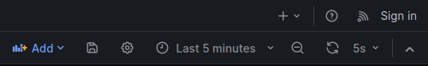
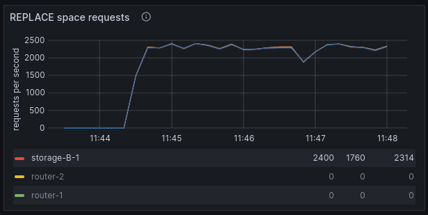
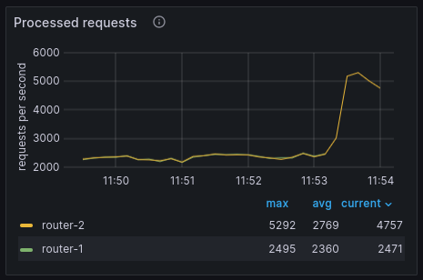
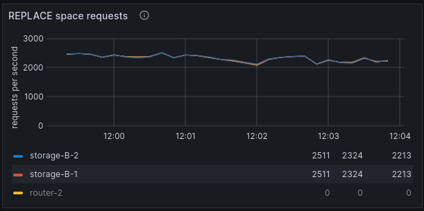

# Реализация функционала балансировщика запросов к роутерам
Тестовый стенд представляет собой набор докер-контейнеров, демонстрирующих
работу с повреждённым кластером под нагрузкой. Стенд состоит из:
* Кластера TarantoolDB
* Клиентского приложения, подающего нагрузку
* Средств мониторинга

Кластер TarantoolDB состоит из двух шардов стораджей и двух роутеров.
Пример приложения производит непрерывную запись строк пачками через все роутеры
по очереди. В качестве операции записи используется `replace`. Если какой-либо
роутер упал, то трафик с него переключается на остальные. Если роутер поднялся,
то на него возвращается трафик.

В качестве средства мониторинга используются следующие компоненты:
* Telegraf - для сбора метрик
* InfluxDB - для хранения
* Grafana - для визуализации

> **Заметка**
> 
> Стенд с Prometheus можно посмотреть [здесь](../go_balancer/)

## Сценарий с падением роутера
### Запуск стенда
Предварительно должен быть установлен:
* [docker-образ Tarantool DB](../../INSTALL.md)
* Maven
* java 8+

Так же необходимо настроить [maven конфиг](../../JAVA_INSTALL.md), чтобы иметь возможность загрузить java connector.

Для успешного запуска должны быть свободны порты:
* 3301 .. 3306
* 8080 .. 8086

Запуск стенда производится командой:
```shell
cd ./doc/examples/java_balancer/tt
docker compose up -d
```

После запуска должны работать все контейнеры, кроме `tarantool-db-init`. Также
после запуска доступны пользовательские интерфейсы по следующим адресам:
* http://localhost:8083 - админка кластера TarantoolDB
* http://localhost:8080 - интерфейс Grafana

Откройте админку кластера и визуально убедитесь, что нет каких либо предупреждений
или ошибок. Сразу после старта в течении нескольких секунд могут быть предупреждения,
так как кластер поднимается.

В левой панели откройте "Space Explorer" и выберите любой узел, например `storage-A-1`.
В нём должен существовать спейс (табличка) `test`.

Откройте Grafana и в ней дашборд
[Tarantool dashboard](http://localhost:8080/d/b2e44626-1163-4a80-b44b-616fe5ad6127/tarantool-dashboard?orgId=1&refresh=5s&from=now-5m&to=now).
Убедитесь, что графики показывают данные за последние 5 минут, а частота обновления обновления равна 5 секундам.



Нам понадобятся разделы "Tarantool Network activity" и "Tarantool operations statistics".
В первом разделе нас интересует график "Processed requests":


Выделите только роутеры (щёлкнуть по названию `router-1` и зажимая Shift щёлкнуть по
названию `router-2`). Либо можно выбрать роутеры на уровне всего дашборда, для этого
следует воспользоваться переключателем сверху:


В панели "Tarantool operations statistics" нас интересует график "REPLACE space requests".
Здесь напротив следует выделить все узлы, кроме роутеров.


### Подача нагрузки
Далее подаём нагрузку. Для этого откройте второй терминал и запустите клиентское приложение:
```shell
cd ./doc/examples/java_balancer
mvn clean compile
mvn exec:java -Dexec.mainClass="org.example.App"
```

Мы увидим нагрузку на графиках. Возрастёт число обработанных запросов на роутерах.
А также возрастёт число операций `replace` в единицу времени.




Откройте "Space Explorer" и убедитесь, что в стораджах появились данные.

### Падение роутера
Теперь организуем падение одного роутера. В первом терминале выполните команду:
```shell
docker compose stop tarantool-router1
```

В админке кластера мы увидим, что узел нездоров (unhealthy). График запросов изменится так:



Мы видим двухкратное увеличение нагрузки на второй роутер. Если посмотреть только
первый роутер, то у него будет вот такой график:


На нём двухкратного роста нагрузки нет. Вместо этого он прерывается. Это происходит
потому, что роутер не работает и метрики с него не поступают. То есть, мы видим,
что вся нагрузка ушла на второй роутер. Количество операций `replace` при этом не
изменилось:


### Восстановление роутера
Для запуска первого роутера выполните команду:
```shell
docker compose start tarantool-router1
```

Админка кластера вернулась в прежнее состояние. Нагрузка на второй роутер уменьшилась
вдвое, появились данные по нагрузке с первого:


Число операций `replace` не изменилось:



### Остановка стенда
Для остановки стенда необходимо во втором терминале нажать клавиши `Ctrl + Z`.
В первом терминале выполнить команду:
```shell
docker compose down
```

## Итог
Пример демонстрирует реализацию функционала балансировки нагрузки и его работу с 
кластером.
