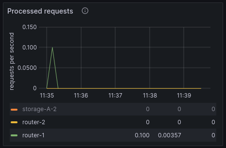
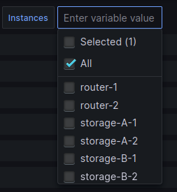
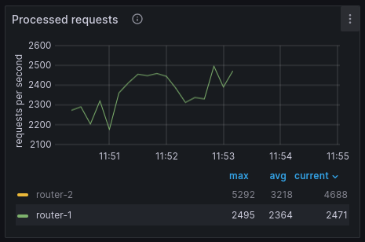
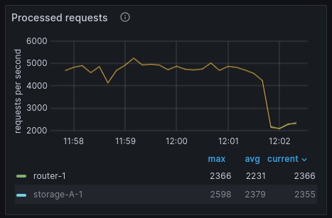

# Балансировка запросов к роутерам через Java-коннектор

В примере демонстрируется работа с повреждённым кластером под нагрузкой.
Приложение непрерывно записывает кортежи пачками через все роутеры по очереди.
Для записи используется операция `replace`.
Если какой-либо роутер упал, трафик с него переключается на остальные роутеры.
Если роутер поднялся, трафик на него возвращается.

Для мониторинга используются:

* Telegraf -- сбор метрик;
* InfluxDB -- хранение метрик;
* Grafana -- визуализация метрик.

```{admonition} Примечание
:class: note

Пример стенда с Prometheus приведен в разделе [Балансировщик запросов к роутерам через Go-коннектор](/examples/go_balancer/connectors_go_balancer.md).
```

Содержание:

* [](user_guide-java_balancer-prereq)
* [](user_guide-java_balancer-start_example)
* [](user_guide-java_balancer-grafana)
* [](user_guide-java_balancer-increase_load)
* [](user_guide-java_balancer-stop_router)
* [](user_guide-java_balancer-start_router)
* [](user_guide-java_balancer-stop_example)

(user_guide-java_balancer-prereq)=
## Пререквизиты

Для выполнения примера требуются:

* установленный [Docker-образ](/install_and_upgrade/install/install_docker.md) Tarantool DB;
* приложение Docker compose;
* Maven;
* Java версии 8+;
* исходные файлы примера `java_balancer`.

  ```{admonition} Примечание
  :class: note

  Есть два способа получить исходные файлы примера:

  * Архив с полной документацией Tarantool DB, полученный по почте или скачанный в [личном кабинете tarantool.io](https://www.tarantool.io/en/accounts/customer_zone/packages/tarantooldb/release/documentation).
    Пример архива: `tarantooldb-documentation-2.0.0.tar.gz`.
    Пример `java_balancer` расположен в таком архиве в директории `./doc/examples/java_balancer/`.
    
  * Отдельный архив [java_balancer.tar.gz](https://tarantool.io/ru/tarantooldb/doc/latest/examples/java_balancer/java_balancer.tar.gz), скачанный c сайта Tarantool.
  ```

Кроме того, для загрузки Java-коннектора нужно настроить конфигурацию Maven.
Чтобы задать эту конфигурацию, используйте инструкцию [Установка клиента tarantool-java-ee](/user_guide/connectors/java/java_install.md).

(user_guide-java_balancer-start_example)=
## Запуск стенда

Для успешного запуска должны быть свободны следующие порты:
* 3301--3306
* 8080--8086

Перейдите в директорию `java_balancer/tt`:

```shell
cd ./doc/examples/java_balancer/tt
```

Запустите стенд:

```shell
docker compose up -d
```

Команда развернет стенд, состоящий из:
* кластера Tarantool DB (два шарда, два хранилища и два роутера);
* клиентского приложения, подающего нагрузку;
* средств мониторинга (Telegraf, InfluxDB, Grafana).

После запуска должны работать все контейнеры, кроме `tarantool-db-init`. Также
после запуска доступны следующие пользовательские интерфейсы:
* http://localhost:8083 -- веб-интерфейс кластера Tarantool DB;
* http://localhost:8080 -- веб-интерфейс Grafana.

Теперь откройте в браузере веб-интерфейс Tarantool DB по адресу [http://localhost:8081](http://localhost:8081).
Перейдите во вкладку **Cluster** и проверьте, что отсутствуют ошибки или предупреждения.
В течение нескольких секунд после старта кластер еще поднимается, так что могут появиться предупреждения.
В примере не используется [шардирование](https://www.tarantool.io/ru/doc/latest/concepts/sharding/), поэтому модуль
`vshard` не запущен.

После этого перейдите на вкладку **Space Explorer** и выберите любой узел, например, `storage1`.
Проверьте, что на узле есть спейс `test`.

(user_guide-java_balancer-grafana)=
## Панель Grafana

Откройте в Grafana панель
[Tarantool dashboard](http://localhost:8080/d/b2e44626-1163-4a80-b44b-616fe5ad6127/tarantool-dashboard?orgId=1&refresh=5s&from=now-5m&to=now).
Проверьте, что графики показывают данные за последние 5 минут, а частота обновления равна 5 секундам:


В панели `Tarantool Network activity` откройте график `Processed requests`:



Выделите роутеры. Есть два способа это сделать:
* нажмите на название `router-1` и, зажав `Shift`, нажмите на `router-2`.
* используйте переключатель сверху, чтобы выбрать роутеры на уровне всего дашборда:



В панели `Tarantool operations statistics` откройте график `REPLACE space requests`.
Выберите все узлы, кроме роутеров:


(user_guide-java_balancer-increase_load)=
## Увеличение нагрузки

Откройте вторую вкладку терминала.
В этой вкладке перейдите в директорию `java_balancer`:

```shell
cd ./doc/examples/java_balancer
```

Запустите клиентское приложение:

```shell
mvn clean compile
mvn exec:java -Dexec.mainClass="org.example.App"
```

На графиках теперь заметно, что нагрузка растет:
* растет число обработанных запросов на роутерах:
  
  
* растет число операций `replace` в единицу времени:

  

В веб-интерфейсе Tarantool DB откройте вкладку **Space Explorer** и проверьте, что в хранилищах появились данные.

(user_guide-java_balancer-stop_router)=
## Имитация отказа роутера

Чтобы имитировать отказ роутера, в первом терминале выполните команду:
```shell
docker compose stop tarantool-router1
```

Теперь в веб-интерфейсе Tarantool DB во вкладке **Cluster** узел `tarantool-router1` помечается как нездоровый (`unhealthy`).
График запросов изменится так:


Нагрузка на второй роутер увеличилась вдвое.
График для второго роутера выглядит так:



Роста нагрузки на этом графике нет.
График прерывается, так как роутер не работает и метрики с него не поступают.
Количество операций `replace` при этом не изменилось:


(user_guide-java_balancer-start_router)=
## Восстановление роутера

Для запуска первого роутера выполните следующую команду:

```shell
docker compose start tarantool-router1
```

В веб-интерфейсе Tarantool DB во вкладке **Cluster** видно, что узел `tarantool-router1` восстановлен.
Нагрузка на второй роутер уменьшилась вдвое, появились данные по нагрузке с первого:



Число операций `replace` не изменилось:


(user_guide-java_balancer-stop_example)=
## Остановка стенда

Для остановки стенда:

* В первом терминале выполните команду:

    ```shell
    docker compose down
    ```
  
* Во втором терминале выполните команду `Ctrl + Z`.
