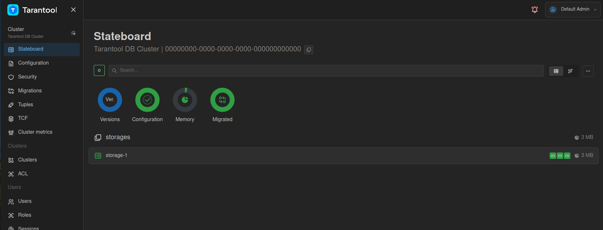
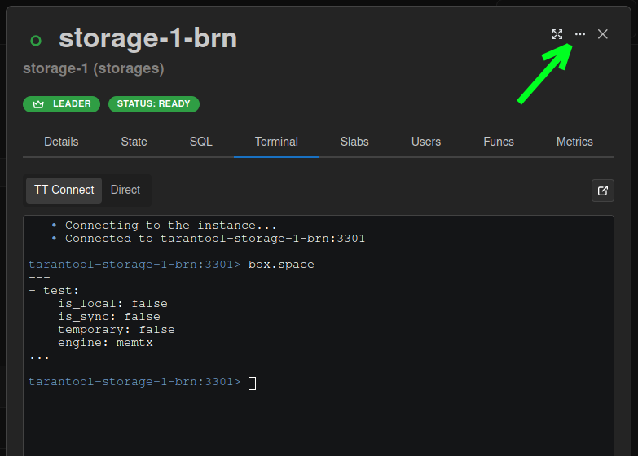

# Работа напрямую с экземпляром Tarantool DB через Java-коннектор

В примере операции выполняются напрямую с конкретным экземпляром.
Такой подход может увеличить производительность, но требует дополнительной
экспертизы -- понимания внутреннего устройства кластера Tarantool DB и принципа его работы.

В этом примере показано, как выполнять операции напрямую с конкретным экземпляром:
приложение записывает по одной строке напрямую в спейс, а также выполняет чтение.

Узнать больше про Java-коннектор можно в репозитории [tarantool/tarantool-java-ee](https://github.com/tarantool/tarantool-java-ee).

Содержание:

* [](user_guide-java_directly-prereq)
* [](user_guide-java_directly-start_example)
* [](user_guide-java_directly-run_application)
* [](user_guide-java_directly-stop_example)

(user_guide-java_directly-prereq)=
## Пререквизиты

Для выполнения примера требуются:

* установленный [Docker-образ](install_docker-image) Tarantool DB;
* приложение Docker Compose;
* Maven;
* Java версии 8+;
* конфигурация Maven -- для загрузки Java-коннектора.
  Чтобы задать эту конфигурацию, используйте инструкцию [Установка клиента tarantool-java-ee](user_guide-connectors-install_java);
* исходные файлы примера `java_directly`.

  ```{admonition} Примечание
  :class: note

  Есть два способа получить исходные файлы примера:

  * Архив с полной документацией Tarantool DB, полученный по почте или скачанный в [личном кабинете tarantool.io](https://www.tarantool.io/en/accounts/customer_zone/packages/tarantooldb/release/documentation).
    Пример архива: `tarantooldb-documentation-2.0.0.tar.gz`.
    Пример `java_directly` расположен в таком архиве в директории `./doc/examples/java_directly/`.

  * Отдельный архив [java_directly.tar.gz](https://tarantool.io/ru/tarantooldb/doc/2.x/examples/java_directly/java_directly.tar.gz), скачанный c сайта Tarantool.
  ```

(user_guide-java_directly-start_example)=
## Запуск стенда

Для успешного запуска должны быть свободны следующие порты:
* 3301
* 8081

Перейдите в директорию `java_directly`:

```shell
cd ./doc/examples/java_directly
```

Запустите стенд:

```shell
cd tt && make start
```

Стенд состоит из:
- кластера Tarantool DB:
  - 2 роутера;
  - 2 набора реплик по 3 хранилища;
- кластера etcd из 3 узлов;
- 1 [Tarantool Cluster Manager](getting_started-tcm) (TCM);
- клиентского приложения, подающего нагрузку.

После запуска должны работать все контейнеры, кроме [init_host](admin_guide-deploy_docker_compose-init_host).

Запись данных будет происходить только на экземпляр `router-msk` по адресу `localhost:3301`.

Также после запуска кластера становится доступен веб-интерфейс TCM.
Для входа в TCM откройте в браузере адрес [http://localhost:8081](http://localhost:8081).
Логин и пароль для входа:

- **Username**: `admin`
- **Password**: `secret`

В TCM откройте вкладку **Stateboard**. После применения настроек кластер будет выглядеть так:



Нажмите на набор реплик `storage-1`, чтобы просмотреть экземпляры в нем. Обратите внимание, что все экземпляры
кластера в этом наборе реплик являются лидерами. Это означает, что набор реплик работает
в режиме [мультимастер](https://www.tarantool.io/en/doc/latest/platform/replication/repl_architecture/#replication-roles).

Выберите любой узел и в открывшемся окне перейдите на вкладку **Terminal**.
Во вкладке **Terminal** проверьте наличие спейса `test`:

```lua
box.space
```

Спейс `test` должен присутствовать в выводе, он создается при запуске кластера.

(user_guide-java_directly-run_application)=
## Запуск приложения

Откройте вторую вкладку терминала.
В этой вкладке перейдите в директорию `java_directly/go`:

```shell
cd ./doc/examples/java_directly
```

Запустите Java-приложение:

```shell
mvn clean compile
mvn exec:java -Dexec.mainClass="org.example.App"
```

Вывод после окончания работы приложения выглядит так:

```
Directly recorded 10000 rows one at a time in 483 milliseconds
Tuples: [[1, 4677746723089159966, aHRDJPQVkTEBttESWzzUH]]
```

Проверьте, что в спейсе `test` появились данные.
Для этого в веб-интерфейсе TCM в окне выбранного узла нажмите на кнопку
вызова меню **...** (**Actions**):


В выпадающем меню выберите пункт **Explorer**. Здесь приведены список спейсов всех типов,
которые есть на данном экземпляре кластера, включая нешардированные спейсы.
В открывшемся списке выберите спейс `test`. Убедитесь, что спейс содержит
данные.

Проверьте этот спейс на других узлах и убедитесь, что репликация работает
исправно.

(user_guide-java_directly-stop_example)=
## Остановка стенда

Чтобы остановить стенд, в локальном терминале выполните следующие команды:

```shell
cd tt && make stop
```

