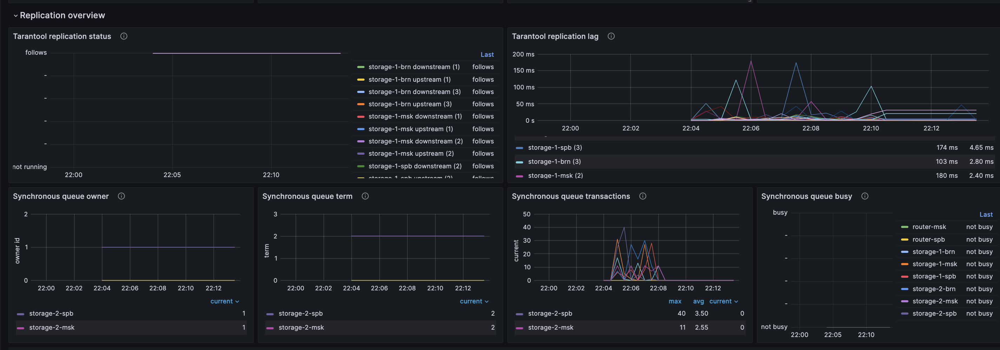
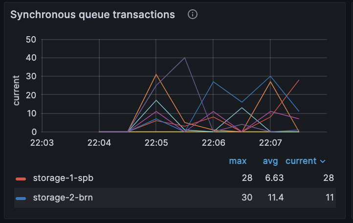
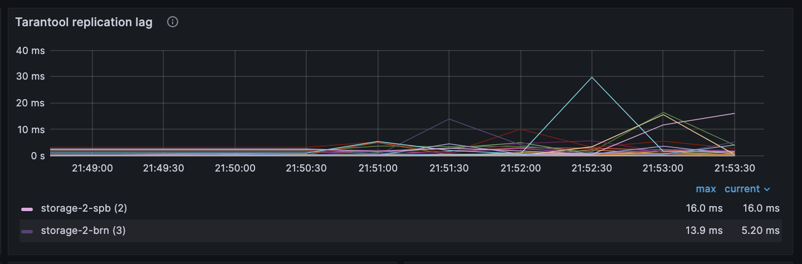
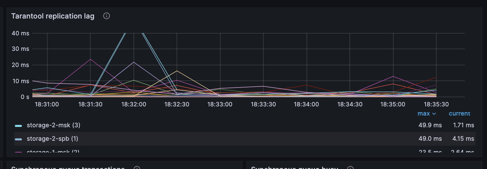

# Использование синхронной репликации

В примере данные записываются в спейс с включенной синхронной репликацией, а после состояние репликации отслеживается
в веб-интерфейсе Grafana.

Для мониторинга в примере используются:

- [Prometheus](https://prometheus.io/) — сбор и хранение метрик;
- [Grafana](https://grafana.com/) — визуализация метрик.

По умолчанию репликация в Tarantool асинхронная: локальный коммит транзакции на master-узле не означает,
что эта транзакция будет сразу же выполнена на экземплярах хранилищ.
Если master-узел сообщит клиенту об успешном выполнении операции, а потом прекратит работу до передачи этой транзакции
соседним узлам и не восстановит свою работу, транзакция клиента пропадет.
Если такой узел восстановил работу, а на другом экземпляре уже есть транзакция с тем же ключом, произойдёт конфликт репликации.
При разрешении такого конфликта нужно будет оставить одну из этих двух транзакций.

Синхронная репликация решает эти проблемы.
Каждая синхронная транзакция подтверждается только после применения на всех экземплярах или после применения на части
экземпляров, составляющих кворум.

Узнать больше о синхронной репликации можно в [документации Tarantool](https://www.tarantool.io/ru/doc/latest/platform/replication/repl_sync/).

Содержание:

- [Пререквизиты](#пререквизиты)
- [Запуск стенда](#запуск-стенда)
- [Подача нагрузки](#подача-нагрузки)
- [Отслеживание состояния репликации в Grafana](#отслеживание-состояния-репликации-в-grafana)
- [Остановка стенда](#остановка-стенда)

## Пререквизиты

Для выполнения примера требуются:

* установленные [Docker-образы](https://www.tarantool.io/docs/tdb/ru/3_x/install_and_upgrade/install/install_docker) Tarantool DB, Prometheus и Grafana;
* приложение Docker Compose;
* Go;
* исходные файлы примера `sync_replication`.

## Запуск стенда

Для успешного запуска должны быть свободны следующие порты:

* 2379
* 3000
* 3301–3308
* 8081
* 9090

Перейдите в директорию примера `sync_replication`:

```shell
cd examples/sync_replication
```

Стенд состоит из следующих компонентов:
- кластер Tarantool DB:
  - 2 роутера;
  - 2 набора реплик по 3 хранилища;
- кластер etcd из 3 узлов;
- 1 [Tarantool Cluster Manager](https://www.tarantool.io/docs/tdb/ru/3_x/getting_started#getting_started-tcm) (TCM);
- клиентское приложение, подающее нагрузку;
- средства мониторинга:
  - [Prometheus](https://prometheus.io/);
  - [Grafana](https://grafana.com/).

Запустите всё, кроме клиентского приложения, следующей командой:

```shell
make start
```

После запуска должны работать все контейнеры, кроме [init_host](../up_with_docker_compose/README.md#контейнер-init_host).

Также после запуска становятся доступны следующие пользовательские интерфейсы:
* [http://localhost:8081](http://localhost:8081) — веб-интерфейс TCM;
* [http://localhost:3000](http://localhost:3000) — веб-интерфейс Grafana.

Для входа в TCM откройте в браузере адрес [http://localhost:8081](http://localhost:8081).
Логин и пароль для входа:

- **Username**: `admin`
- **Password**: `secret`

В TCM откройте вкладку **Stateboard**.

Выберите в наборе реплик `router-msk` узел `router-msk` и в открывшемся окне перейдите на вкладку **Terminal**.
Во вкладке **Terminal** проверьте наличие спейсов `sync_space` и `async_space`:

```lua
box.space
```

Спейсы `sync_space` и `async_space` должны присутствовать в выводе, они создаются при запуске кластера.

## Подача нагрузки

Откройте вторую вкладку локального терминала.
В этой вкладке перейдите в директорию `sync_replication/go`:

```shell
cd examples/sync_replication/go
```

В примере при запуске кластера был создан спейс `sync_space`.
Синхронная репликация для этого спейса включена с помощью опции `is_sync = true`:

```lua
local users = box.schema.space.create('sync_space', {if_not_exists = true, is_sync = true})
users:format({
    { name = 'uuid', type = 'string' },
    { name = 'bucket_id', type = 'unsigned' },
    { name = 'too', type = 'number' },
    { name = 'foo', type = 'string' },
})
```

Запустите клиентское приложение, которое запишет данные в спейс `sync_space`:

```shell
go run -tags go_tarantool_ssl_disable main.go -target=sync
```

Здесь:

- `go_tarantool_ssl_disable` — опция, отключающая поддержку TLS.
  Так как для поддержки TLS требуется установленный OpenSSL 3.x, для простоты в примере поддержка TLS отключена.
- `target` — опция определяет, в какой спейс будут записаны данные. Возможные значения:
  - `sync` — запись в спейс с синхронной репликацией;
  - `async` — запись в спейс с асинхронной репликацией.

Проверьте, что в спейсе `sync_space` появились данные.
Для этого в веб-интерфейсе TCM перейдите на вкладку **Tuples** и выберите в списке спейс `sync_space`.
Откроется новая вкладка с содержимым кортежей спейса `sync_space`.

Также обратите внимание, что нет ошибок в терминале клиентского приложения.

Если в опции `target` задано значение `async`, данные будут записаны в спейс `async_space`:

```lua
local profiles = box.schema.space.create('async_space', { if_not_exists = true })
profiles:format({
    { name = 'uuid', type = 'string' },
    { name = 'bucket_id', type = 'unsigned' },
    { name = 'too', type = 'number' },
    { name = 'foo', type = 'string' },
})
```

Синхронная репликация для этого спейса отключена.
Это означает, что допускается выборочное включение синхронной репликации на отдельные спейсы.

В этом примере в топологии кластера два набора реплик по три хранилища.
Если отключить одно из хранилищ при записи в асинхронный спейс, другое хранилище станет master-узлом и запись в спейс возобновится.
При синхронной репликации данные записываются сразу во все экземпляры хранилищ.

В режиме отказоустойчивости `election` (RAFT) для автоматического переключения master-узла набор реплик должен содержать не
менее трех экземпляров, включая master-узел.
Если в наборе реплик меньше трех узлов, master-узел не переключится самостоятельно и будут возвращаться ошибки.
Если экземпляров в наборе реплик мало, используйте режим отказоустойчивости `etcd`.

## Отслеживание состояния репликации в Grafana

Откройте в браузере веб-интерфейс Grafana по адресу [http://localhost:3000/dashboards](http://localhost:3000/dashboards).
В списке **Dashboards** выберите панель **Tarantool DB dashboard** в папке **General**.
Проверьте, что графики показывают данные за последние 15 минут.

Чтобы отслеживать состояние репликации, разверните панель **Tarantool replication overview**.



Обратите внимание, как выглядят графики **Synchronous queue transactions** и **Tarantool replication lag**
при включенной синхронной репликации.

График **Synchronous queue transactions**:



График **Tarantool replication lag**:



На втором графике видно, что фоновое значение **Tarantool replication lag** колеблется в пределах 40 мс.
Для наглядности размер оси Y выставлен до 40 мс.
Синхронная репликация работает медленнее из-за добавления времени `replication_lag` к времени коммита.

При переключении нагрузки на запись в асинхронный спейс графики изменятся.
График **Synchronous queue transactions** теперь выглядит так:


Фоновое значение **Tarantool replication lag** теперь не превышает 10 мс.
Это означает, что лаг при асинхронной репликации стал меньше:



## Остановка стенда

Для остановки стенда:

* В первом локальном терминале выполните следующую команду:

```shell
make stop
```

* Во втором локальном терминале выполните команду `Ctrl + C`.
