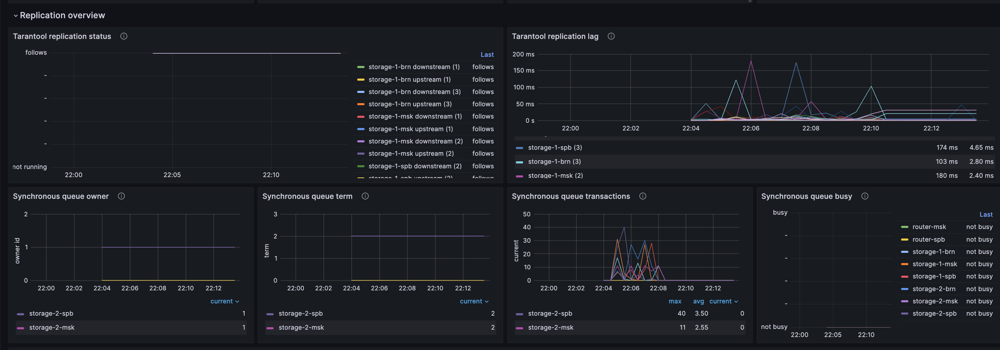
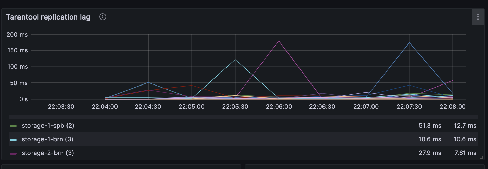
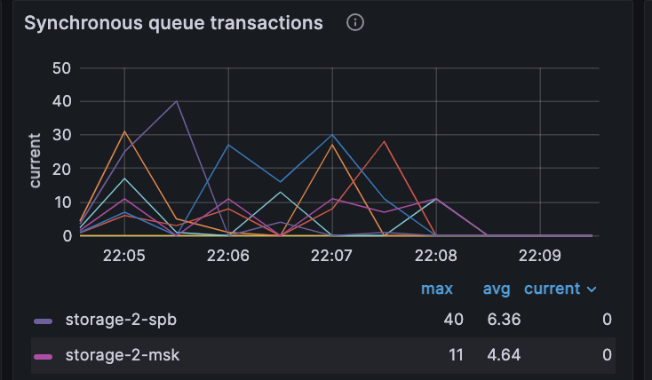
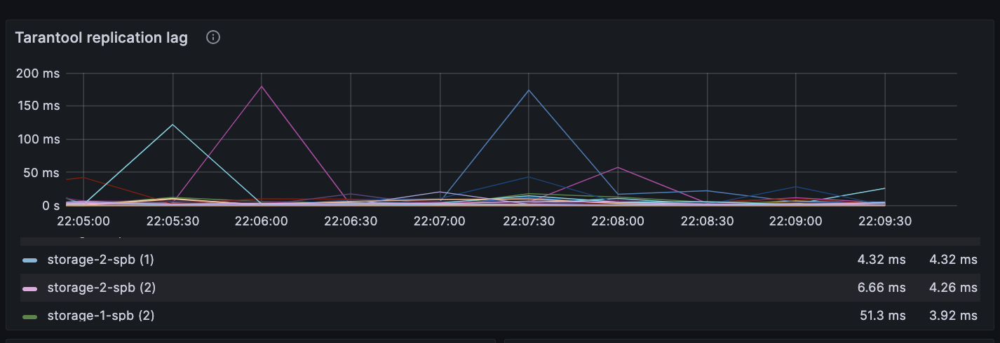
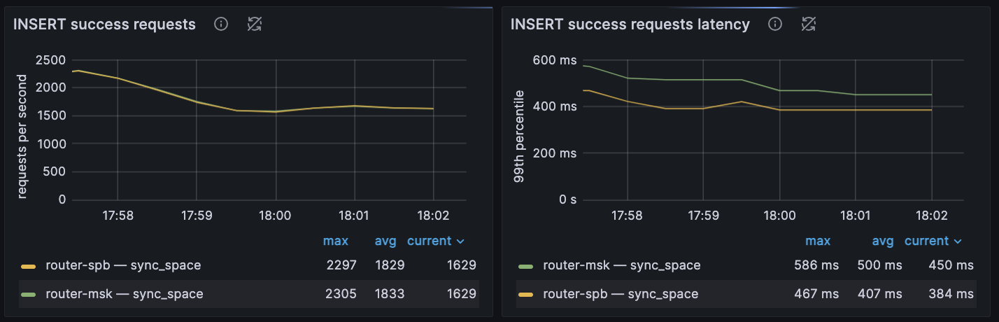

(connectors-go_balancer)=
# Пример работы с синхронной репликацией

В примере демонстрируется работа с синхронной репликацией.
По умолчанию репликация в Tarantool асинхронная: локальный коммит транзакции на мастере не означает, что эта транзакция будет сразу же выполнена на репликах.
Если мастер сообщит клиенту об успешном выполнении операции, а потом прекратит работу до передачи этой транзакции соседям и после отказа не восстановится, то эта транзакция клиента пропадет. Кроме того в случае, если данный узел восстановился, а на другом уже есть транзакция по тому же ключу, произойдёт конфликт репликации. При разрешении которого нужно будет оставить одну из этих двух транзакций.
Эти проблемы решает синхронная репликация. Каждая синхронная транзакция подтверждается только после применения на всех экземплярах или после применения на части экземплярах составляющих кворум.

Для мониторинга используются:

* [Prometheus](https://prometheus.io/) -- сбор и хранение метрик;
* [Grafana](https://grafana.com/) -- визуализация метрик.
Содержание:

* [](user_guide-sync_replication-prereq)
* [](user_guide-sync_replication-start_example)
* [](user_guide-sync_replication-push_load)
* [](user_guide-go_balancer-stop_example)

(user_guide-sync_replication-prereq)=
## Пререквизиты

Для выполнения примера требуются:

* установленный [Docker-образ](install_docker-image) Tarantool DB;
* приложение Docker Compose;
* Go;
* исходные файлы примера `sync_replication`.
 
(user_guide-sync_replication-start_example)=
## Запуск стенда

Для успешного запуска должны быть свободны следующие порты:

* 3301--3308
* 8081
* 3000

Перейдите в директорию `sync_replication/tt`:

```shell
cd ./doc/examples/sync_replication/tt
```

Стенд состоит из:
- кластера Tarantool DB:
  - 2 роутера;
  - 2 набора реплик по 3 хранилища;
- кластера etcd из 3 узлов;
- 1 [Tarantool Cluster Manager](getting_started-tcm) (TCM);
- клиентского приложения, подающего нагрузку;
- средств мониторинга -- [Prometheus](https://prometheus.io/), [Grafana](https://grafana.com/).

Запустите всё, кроме клиентского приложения, следующей командой:

```shell
make start
```

После запуска должны работать все контейнеры, кроме [init_host](admin_guide-deploy_docker_compose-init_host).

Также после запуска доступны следующие пользовательские интерфейсы:
* [http://localhost:8081](http://localhost:8081) -- веб-интерфейс TCM;
* [http://localhost:3000](http://localhost:3000) -- веб-интерфейс Grafana.

Для входа в TCM откройте в браузере адрес [http://localhost:8081](http://localhost:8081).
Логин и пароль для входа:

- **Username**: `admin`
- **Password**: `secret`

В TCM откройте вкладку **Stateboard**.

Выберите в наборе реплик `router-msk` узел `router-msk` и в открывшемся окне перейдите на вкладку **Terminal**.
Во вкладке **Terminal** проверьте наличие спейсов `sync_space` и `async_space`:

```lua
box.space
```

Спейсы `sycn_space` и `async_space` должны присутствовать в выводе, они создаются при запуске кластера.

(user_guide-sync_replication-push_load)=
## Подача нагрузки

Откройте вторую вкладку локального терминала.
В этой вкладке перейдите в директорию `go`:

```shell
cd ./doc/examples/sync_replication/go
```

Запустите клиентское приложение:

```shell
go run -tags go_tarantool_ssl_disable main.go target=sync
```

Здесь:

* `go_tarantool_ssl_disable` -- опция, отключающая поддержку TLS.
  Так как для поддержки TLS требуется установленный OpenSSL 3.x, для простоты в примере поддержка TLS отключена.
* `target` -- может принимать значения `sync` или `async`. Нужно для условия, при котором запись происходит в спейс с синхронной репликацмей или асинхронной.

Проверьте, что в спейсе `sync_space` появились данные.
Для этого в веб-интерфейсе TCM перейдите на вкладку **Tuples** и выберите в списке спейс `sync_space`.
Откроется новая вкладка с содержимым кортежей спейса `sync_space`.

Также данные должны записаться в спейс `async_space`, есди вы передаете `target=async`. Но как можно увидеть в схеме для этого спейса синхронная репликация отключена.
Из этого следует, что допускается выборочное включение синхронной репликации на отдельные спейсы.

Также нужно обратить внимание, что нет ошибок в терминале клиентского приложения.

В этом примере в топологии есть два набора реплик по 3 хранилища.
При записи в асинхронный спейс, если отключить одно из хранилищ, то другое станет лидером и запись продолжится. При этом стоит принимать во внимание, что при синхронной репликации данные записываются сразу во все реплики.
Отметим также, что для автоматического переключения лидера в режиме отказоустойчивости `election` (RAFT) должно быть не менее трех реплик (включая лидера) в репликасете. В противном случае лидер сам не переключится и будут возвращаться ошибки. Если реплик мало, то стоит использовать режим отказоустойчивости `etcd`.

Состояние репликации можно отслеживать в дашборде `Replication overview`:


Обратите внимание на графикики `Synchronyos queue transactions` и `Tarantool replication lag`
При синхронной репликации они такие:


При асинхронной репликации они такие (внимание на конец графика, в этот момет была переключена нагрузка на запись в асинхронный спейс):



Также можно заметить увеличивающиеся нагрузку по метрикам:


(user_guide-go_balancer-stop_example)=
## Остановка стенда

Для остановки стенда:

* В первом локальном терминале вернитесь в директорию `sync_replication/tt`:

  ```shell
  cd ./doc/examples/sycn_replication/tt
  ```

  Выполните следующую команду:

  ```shell
  make stop
  ```

* Во втором локальном терминале выполните команду `Ctrl + Z`.
