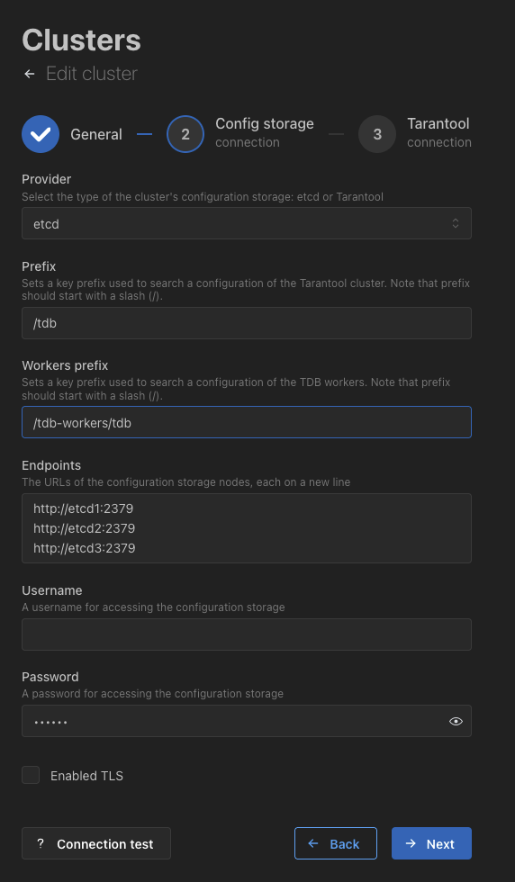
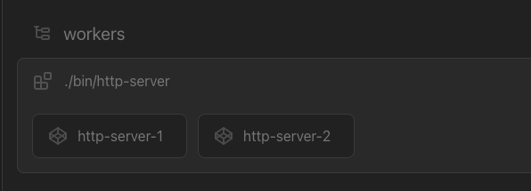
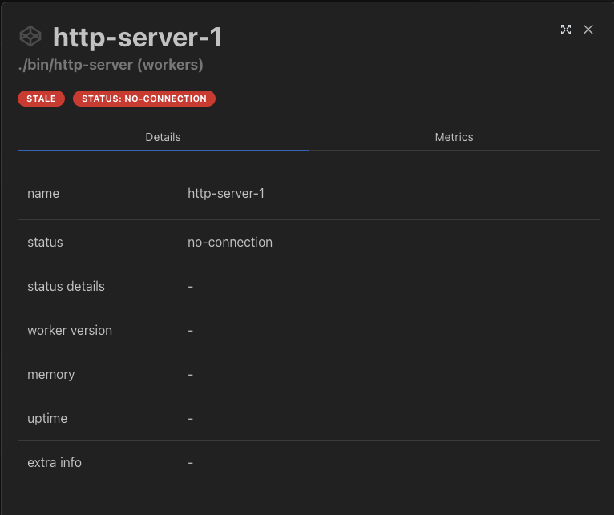
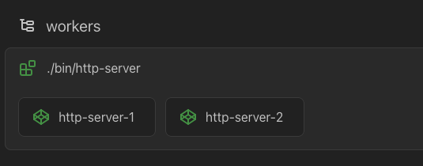
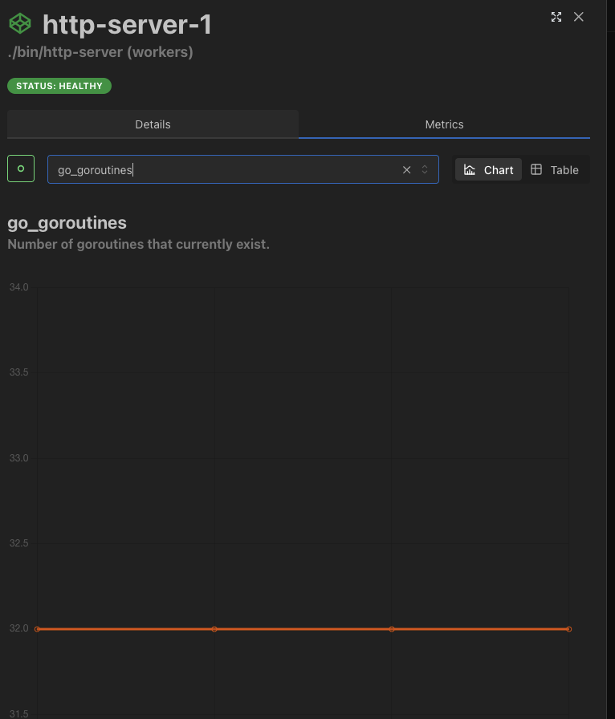
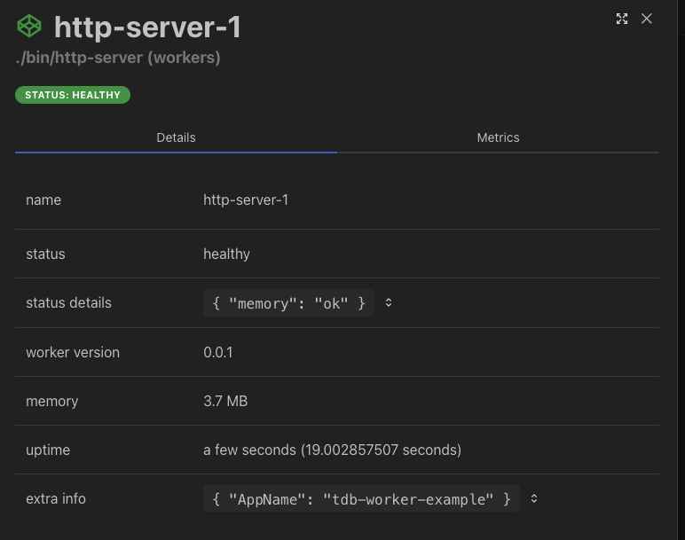

# Использование узлов-обработчиков

Доступно с версии 3.1.0.

В этом руководстве показано, как разрабатывать приложения Go-обработчиков для работы с Tarantool DB с помощью библиотек из экосистемы Tarantool.
*Обработчик* — это программа на языке Go, которая:

- использует библиотеки из экосистемы Tarantool для работы с кластером и централизованным хранилищем конфигурации;
- хранит свою конфигурацию в централизованном хранилище конфигурации — etcd или
  хранилище на основе Tarantool (*Tarantool-based configuration storage*, далее — TBCS).

Использование обработчика позволяет:

- вынести сложную логику по работе с данными отдельно от Tarantool;
- предоставить удобные интерфейсы доступа к данным;
- интегрировать экземпляры обработчика с кластером Tarantool DB — например при развертывании через ATE и взаимодействии через веб-интерфейс TCM.

> [!NOTE]
> Запуск с помощью Docker Compose является вспомогательным и используется для тестирования и демонстрации
> в примерах документации. Для целевого развертывания используйте [инсталлятор Ansible Tarantool Enterprise](https://www.tarantool.io/docs/tdb/ru/3_x/install_and_upgrade/install/install_ate#install_guide-ate).

Содержание:

* [Пререквизиты](#пререквизиты)
* [Запуск стенда](#запуск-стенда)
* [Используемые файлы](#используемые-файлы)
* [Сборка обработчика](#сборка-обработчика)
* [Запуск обработчика](#запуск-обработчика)
* [Взаимодействие с кластером Tarantool DB](#взаимодействие-с-кластером-tarantool-db)
* [Мониторинг состояния обработчика и интеграция с TCM](#мониторинг-состояния-обработчика-и-интеграция-с-tcm)
* [Остановка стенда](#остановка-стенда)

## Пререквизиты

Для выполнения примера требуются:

* установленные [Docker-образы](https://www.tarantool.io/docs/tdb/ru/3_x/install_and_upgrade/install/install_docker) Tarantool DB, Prometheus и Grafana;
* приложение Docker Compose;
* утилита `etcdctl`;
* компилятор Go;
* исходные файлы примера `tdb_worker`.

> [!NOTE]
>  Есть два способа получить исходные файлы примера:
>  * Репозиторий [github.com/tarantool/tarantooldb-examples](https://github.com/tarantool/tarantooldb-examples/tree/release-3x/master).
>    Пример `tdb_worker` расположен в директории `examples/tdb_worker`.
>  * Отдельный архив [tdb_worker.zip](https://download-directory.github.io/?url=https%3A%2F%2Fgithub.com%2Ftarantool%2Ftarantooldb-examples%2Ftree%2Frelease-3x%2Fmaster%2Fexamples%2Ftdb_worker&filename=tdb_worker), скачанный из этого репозитория.

## Запуск стенда

Перейдите в директорию примера `tdb_worker`:

```shell
cd examples/tdb_worker
```

Запустите стенд:

```shell
make start
```

Запущенный стенд состоит из:

- кластера Tarantool DB (2 роутера, 2 набора реплик по 3 хранилища);
- кластера etcd из 3 узлов для хранения конфигурации;
- 1 [Tarantool Cluster Manager](https://www.tarantool.io/docs/tdb/ru/3_x/getting_started#getting_started-tcm) (TCM);
- средств мониторинга — [Prometheus](https://prometheus.io/), [Grafana](https://grafana.com/).

После запуска становится доступен веб-интерфейс TCM.
Для входа в TCM откройте в браузере адрес [http://localhost:8081](http://localhost:8081).
Логин и пароль для входа:

- **Username**: `admin`
- **Password**: `secret`

## Используемые файлы

В руководстве используются следующие файлы примера `tdb_worker`:

* `cluster/config.yml` — конфигурация и топология кластера;
* `cluster/docker-compose.yml` — описание узлов кластера Tarantool DB;
* `docker-compose-worker.yml` — описание узлов-обработчиков;
* `main.go` — исходный код обработчика;
* `http-server-1-config.yml` — конфигурация первого обработчика;
* `http-server-2-config.yml` — конфигурация второго обработчика.

## Сборка обработчика

Исходный код обработчика хранится в файле `main.go` в примере `tdb_worker`.

Для сборки обработчика выполните команду ниже:

```shell
CGO_ENABLED=0 GOOS=linux GOARCH=amd64 go build -o bin/http-server ./main.go
```

Конфигурация узлов-обработчиков хранится в файлах `http-server-1-config.yml`, `http-server-2-config.yml` и загружается в хранилище конфигурации
(в примере это etcd) при запуске стенда.

Прочитать её можно так:

```shell
ETCDCTL_API=3 etcdctl get --prefix '/tdb-workers/'
```

Сама конфигурация выглядит так:

```yaml
/tdb-workers/tdb/instances/127.0.0.1/http-server-1
type: nontarantool
instrumentation: # параметры мониторинга
    url:            worker-1:9080
    metrics_url:    /metrics
    metrics_format: "prometheus"
    liveness_url:   /alive
    info_url:       /info
    binary:         ./bin/http-server
config: # произвольная конфигурация обработчика
    addr:                       0.0.0.0:10000
    tarantool_cluster_prefix:   /tdb/config/all
    tarantool_user:             admin
    tarantool_pass:             secret-cluster-cookie
```


Описание конфигурации приведено в соответствующем разделе [справочника](https://www.tarantool.io/docs/tdb/ru/3_x/reference/configuration_worker).

У каждого обработчика конфигурация хранится по отдельному ключу:

* `/tdb-workers/tdb` — префикс для хранения конфигураций экземпляров обработчиков;
* `127.0.0.1` — адрес хоста обработчика (*ansible host*);
* `http-server-1` — имя обработчика.

Префикс для конфигурации обработчиков можно задать через веб-интерфейс TCM. Для этого:

1. В TCM перейдите на вкладку **Clusters** и нажмите на кнопку
вызова меню **...** (**Actions**) справа от нужного кластера (в примере это кластер **Tarantool DB Cluster**).
2. В выпадающем меню выберите пункт **Edit** и перейдите на вкладку настроек **Config storage connection**, нажав кнопку **Next**.
3. На вкладке **Config storage connection** введите название префикса в поле **Workers prefix**.



## Запуск обработчика

Для старта узла-обработчика обязательны следующие переменные окружения:

- `TDB_WORKER_NAME=http-server-1` — имя обработчика. Тип: `string`;
- `TDB_WORKER_HOST_NAME=127.0.0.1` — название хоста, на котором расположен обработчик.  Тип: `string`.
- `TDB_WORKER_CONFIG_ETCD_PREFIX=/tdb-workers/tdb/instances` — путь префикса в централизованном хранилище конфигурации etcd, который указывает расположение конфигурации обработчиков. Тип: `string`.

Также можно указать дополнительные параметры для подключения, аналогичные параметрам для Tarantool:

- `TDB_WORKER_CONFIG_ETCD_USERNAME` — имя пользователя для подключения к централизованному хранилищу конфигурации etcd. Тип: `string`. Значение по умолчанию: `""`;
- `TDB_WORKER_CONFIG_ETCD_PASSWORD` — пароль для подключения к централизованному хранилищу конфигурации etcd. Тип: `string`. Значение по умолчанию: `""`;
- `TDB_WORKER_CONFIG_ETCD_ENDPOINTS=http://etcd1:2379` — список узлов централизованного хранилища конфигурации для подключения, узлы указываются через запятую. Тип: `array`;

Также можно указать опции SSL-подключения:

- `TDB_WORKER_CONFIG_ETCD_SSL_VERIFY_PEER` — наличие проверки peer-сертификата etcd. Тип: `boolean`.  Значение по умолчанию: `false`;
- `TDB_WORKER_CONFIG_ETCD_SSL_VERIFY_HOST` — наличие проверки master-сертификата etcd. Тип: `boolean`.  Значение по умолчанию: `false`;
- `TDB_WORKER_CONFIG_ETCD_SSL_CA_PATH` — путь к доверенному CA-сертификату, используемому для установки соединения с etcd. Тип: `string`;
- `TDB_WORKER_CONFIG_ETCD_SSL_CERT` — путь к клиентскому SSL-сертификату, используемому для установки соединения с etcd. Тип: `string`;
- `TDB_WORKER_CONFIG_ETCD_SSL_KEY` — путь к клиентскому SSL-ключу, используемому для установки соединения с etcd. Тип: `string`.

Для TBCS используются схожие параметры, но с другим префиксом.
- `TDB_WORKER_CONFIG_STORAGE_PREFIX`
- `TDB_WORKER_CONFIG_STORAGE_ENDPOINTS`

Узнать больше про настройку [etcd](https://www.tarantool.io/en/doc/latest/reference/configuration/configuration_reference/#config-etcd) и [TBCS](https://www.tarantool.io/en/doc/latest/reference/configuration/configuration_reference/#config-storage) можно в документации платформы Tarantool.

Если зайти в TCM по адресу [http://localhost:8081](http://localhost:8081), на вкладке **Stateboard** вы увидите секцию с обработчиками:


Сейчас эти узлы отключены, поэтому они подсвечены серым цветом.
Если нажать на такой узел, в открывшемся окне  будет видно, что узел имеет статус `no-connection`:




Запустите узлы-обработчики:

```shell
docker compose -f docker-compose-worker.yml up -d worker-1 worker-2
```

Проверьте логи:

```shell
docker compose -f docker-compose-worker.yml logs
```

В логах должны появиться следующие строки:

```
worker-1-1  | http-server-1 /tdb-workers/tdb/instances/127.0.0.1
worker-1-1  | 2026-01-29T11:36:39Z INFO /home/user/tarantooldb/doc/examples/tdb_worker/main.go:213 "starting http server" addr=0.0.0.0:10000
worker-1-1  | 2026-01-29T11:36:39Z INFO /home/user/tarantooldb/doc/examples/tdb_worker/main.go:194 "starting instrumentation server" addr=worker-1:9080
worker-2-1  | http-server-2 /tdb-workers/tdb/instances/127.0.0.1
worker-2-1  | 2026-01-29T11:36:39Z INFO /home/user/tarantooldb/doc/examples/tdb_worker/main.go:213 "starting http server" addr=0.0.0.0:10001
worker-2-1  | 2026-01-29T11:36:39Z INFO /home/user/tarantooldb/doc/examples/tdb_worker/main.go:194 "starting instrumentation server" addr=worker-2:9081
```

В TCM обработчики будут отображаться так:



Обработчик запускает два простых HTTP‑сервера:
- сервер для доступа к спейсу `bands`;
- сервер для мониторинга и интеграции с TCM.

Добавьте новые кортежи в спейс `bands`:

```shell
curl -X POST http://127.0.0.1:10000/api/bands -d '{"id":1,"band_name":"name", "year":2024}'
curl -X POST http://127.0.0.1:10001/api/bands -d '{"id":2,"band_name":"name-2", "year":2025}'
```

Теперь прочитайте записанные кортежи:

```shell
curl http://127.0.0.1:10000/api/bands/1
curl http://127.0.0.1:10000/api/bands/2
```

Ответ:
```json
{"id":1,"band_name":"name","year":2024}
{"id":2,"band_name":"name-2","year":2025}
```

## Взаимодействие с кластером Tarantool DB

Обработчик использует библиотеку `go‑discovery`, которая позволяет реагировать на изменения конфигурации кластера и динамически обновлять группу соединений.
Это позволяет добавлять и удалять узлы без перезапуска обработчика.

В коде это реализовано следующим образом:

1. Создание группы соединений для подключения к кластеру Tarantool DB:

    ```go
    // Create pool for tarantool DB cluster.
    pool, err := pool.NewPool(
        dial.NewNetDialerFactory(
            workerCfg.Config.TarantoolUser,
            workerCfg.Config.TarantoolPass,
            tarantool.Opts{
                Timeout: 5 * time.Second,
            },
        ),
        pool.NewRoundRobinBalancer(),
    )
    ```

2. Подписка на изменения конфигурации (узлы с ролью `roles.crud‑router`):

    ```go
    // The scheduler will watch for updates from etcd.
    etcdWatcher := scheduler.NewEtcdWatch(
        clientv3,
        workerCfg.Config.TarantoolClusterPrefix,
    )
    defer etcdWatcher.Stop()

    disc := discoverer.NewFilter(
        // The base discoverer gets a list of instance configurations from
        // etcd.
        discoverer.NewEtcd(clientv3,
            strings.TrimSuffix(
                workerCfg.Config.TarantoolClusterPrefix,
                "/config/all",
            ),
        ),
    )

    // The Subscriber will send instance configurations into the pool
    // on updates.
    etcdSubscriber := subscriber.NewFilter(
        subscriber.NewSchedule(etcdWatcher, disc),
        // etcdSubscriber will track new crud-routers in cluster configuration
        filter.RolesContain{
            Roles: []string{"roles.crud-router"},
        },
    )
    ```

Подробная информация приведена в документации библиотеки [go‑discovery](https://github.com/tarantool/go-discovery).

### Работа с библиотекой go‑discovery

1. В веб‑интерфейсе TCM перейдите на вкладку **Configuration** и раскомментируйте конфигурацию для узла `router‑brn`:

    ```yaml
    router-brn:
        leader: router-brn
        instances:
         router-brn:
           iproto:
             listen:
               - uri: tarantool-router-brn:3301
             advertise:
               client: tarantool-router-brn:3301
    ```

2. Нажмите **Save** и затем **Apply**, чтобы сохранить и применить новую конфигурацию кластера.
3. В журнале событий обработчика появится сообщение об отсутствии подключения к узлу `router‑brn`.
4. Запустите экземпляр `router‑brn`:

    ```shell
    docker compose -f docker-compose-worker.yml up -d tarantool-router-brn
    ```

5. Теперь запросы будут распределяться и на `router‑brn`.
6. Для дополнительной проверки можно закомментировать конфигурации экземпляров `router‑msk` и `router‑spb`, а затем остановить соответствующие контейнеры.

    ```shell
        docker compose -f cluster/docker-compose.yml down tarantool-router-msk
        docker compose -f cluster/docker-compose.yml down tarantool-router-spb
    ```
    Обработчик продолжит работать, используя оставшиеся роутеры.

Возможность реагировать на изменения конфигурации и переконфигурировать группу соединений значительно повышает гибкость обработчика.

Также обратите внимание на библиотеку [go-tlog](https://github.com/tarantool/go-tlog) — это обертка пакета `slog`, которая позволяет обработчику писать логи в том же формате, что и Tarantool. Такой подход полезен для анализа логов.

## Мониторинг состояния обработчика и интеграция с TCM

Обработчик предоставляет три адреса обработчика запроса (*endpoints*) для отслеживания своего состояния и интеграции с TCM:

- [/healthcheck](#проверка-работоспособности-обработчика) — проверка работоспособности узла обработчика;
- [/metrics](#метрики) — метрики экземпляра обработчика;
- [/info](#информация-об-обработчике) — общая информация об обработчике.

Задавать эти адреса обработчика запроса необязательно, но они позволяют TCM взаимодействовать с узлами-обработчиками.
Хранение конфигурации в централизованном хранилище конфигурации, формат конфигурации и указание таких адресов обработчика запроса позволяют успешно интегрировать экземпляры обработчиков в поставку вместе с Tarantool DB.

### Проверка работоспособности обработчика

Запрос возвращает в ответе один из следующих HTTP-статусов:

- `200` с телом ответа `{"status":"alive"}` — узел обработчика здоров, все проверки завершены успешно;
- `500` с телом ответа `{"status":"dead", "details":{"error": "error_message"}}` — обработчик недоступен, описание проблем приведено в поле `details`. Пример ответа: `{"status":"dead", "details":{"tdb_unreachable":"failed to connect to host.private:3301"}}`;
- `520` с телом ответа `{"status":"degraded", "details":{"error": "error_message"}}` — в работе обработчика возникли проблемы, их описание приведено в поле `details`. Пример ответа: `{"status":"degraded", "details":{"memory":"memory limit reached"}}`.

Значение в ответе определяет, каким цветом подсвечен узел обработчика в TCM:

* `alive` — зелёный;
* `dead` — красный;
* `degraded` — жёлтый.

### Метрики

Адрес обработчика запроса `/metrics` отдаёт метрики в формате Prometheus:

```shell
curl http://127.0.0.1:9080/metrics | head -n 5
curl http://127.0.0.1:9081/metrics | head -n 5
```

Чтобы просмотреть метрики узла-обработчика в TCM, перейдите на вкладку **Stateboard**, нажмите на соответствующий узел, и в открывшемся окне перейдите на вкладку **Metrics**:



Подробная информация о мониторинге в Tarantool DB и поддерживаемых метриках приведена в разделе [Мониторинг в Tarantool DB](https://www.tarantool.io/docs/tdb/ru/3_x/admin_guide/monitoring).

### Информация об обработчике

Адрес обработчика запроса `/info` предоставляет общую информацию об экземпляре обработчика:

```shell
curl http://127.0.0.1:9080/info
```

Формат ответа выглядит так:

```json
{
  "version": "1.0.0",
  "uptime_seconds": 362349.44,
  "memory_usage_bytes": 209213124,
  "extra_info": {
    "env": "staging",
    "my_custom": "foo-bar"
  }
}
```

Чтобы просмотреть информацию об обработчике в TCM, перейдите на вкладку **Stateboard** и нажмите на соответствующий узел. Откроется окно **Details**:




## Остановка стенда

Для остановки стенда выполните в локальном терминале команды ниже:

```shell
make stop
docker compose -f docker-compose-worker.yml down
```
