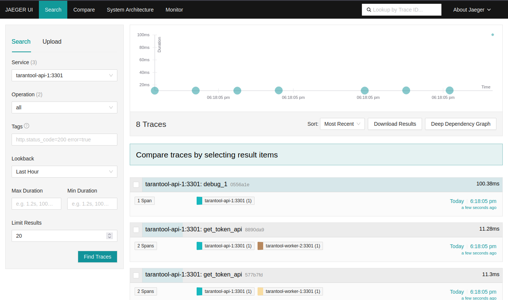
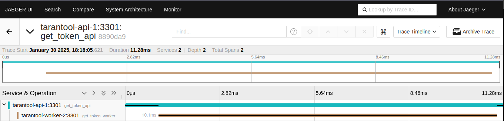

# Трассировка с использованием Jaeger

В этом руководстве описано, как настроить трассировку функций, а также просмотреть и оценить результаты трассировки
в веб-интерфейсе [Jaeger](https://www.jaegertracing.io/).

Подробнее о модуле `tracing` можно узнать в разделе [Оценка производительности](https://www.tarantool.io/docs/tdb/ru/2_x/admin_guide/troubleshooting/tracing).

Руководство включает следующие шаги:

* [Пререквизиты](#пререквизиты)
* [Запуск стенда](#запуск-стенда)
* [Определение конфигурации](#определение-конфигурации)
* [Подключение к узлу](#подключение-к-узлу)
* [Оценка результатов трассировки](#оценка-результатов-трассировки)
* [Остановка стенда](#остановка-стенда)

## Пререквизиты

Для выполнения примера требуются:

* установленный [Docker-образ](https://www.tarantool.io/docs/tdb/ru/2_x/install_and_upgrade/install/install_docker) Tarantool DB;
* приложение Docker Compose;
* утилита [tt CLI](https://www.tarantool.io/docs/tdb/ru/2_x/install_and_upgrade/install_tt);
* сервис для сбора данных трассировки [Jaeger](https://www.jaegertracing.io/);
* исходные файлы примера `tracing`.

> [!NOTE]
>  Есть два способа получить исходные файлы примера:
>  * Репозиторий [github.com/tarantool/tarantooldb-examples](https://github.com/tarantool/tarantooldb-examples/tree/release-2x/master).
>    Пример `tracing` расположен в директории `examples/tracing`.
>  * Отдельный архив [tracing.zip](https://download-directory.github.io/?url=https%3A%2F%2Fgithub.com%2Ftarantool%2Ftarantooldb-examples%2Ftree%2Frelease-2x%2Fmaster%2Fexamples%2Ftracing&filename=tracing), скачанный из этого репозитория.

## Запуск стенда

Перейдите в директорию примера `tracing`:

```
cd examples/tracing
```

Запустите стенд:

```shell
make start
```

Запущенный стенд состоит из:
- кластера Tarantool DB:
   - 1 роутер;
   - 2 набора реплик по 1 хранилищу;
- кластера etcd из 3 узлов;
- 1 узла [Tarantool Cluster Manager](https://www.tarantool.io/docs/tdb/ru/2_x/getting_started#getting_started-tcm) (TCM).
- сервиса Jaeger для сбора данных трассировки.

После запуска должны работать все контейнеры, кроме [init_host](../up_with_docker_compose/README.md#контейнер-init_host).

Также после запуска кластера становится доступен веб-интерфейс TCM.
Для входа в TCM откройте в браузере адрес [http://localhost:8081](http://localhost:8081).
Логин и пароль для входа:
- **Username**: `admin`
- **Password**: `secret`

## Определение конфигурации

В примере указаны следующие параметры трассировки:

```yaml
roles_cfg:
  app.roles.tracing:
    enabled: true
    global_sample_rate: 0
    sample_rates:
      get_token_api: 2
      debug_1: 1
    base_url: 'http://tracing:9411/api/v2/spans'
    api_method: 'POST'
    report_interval: 1
    spans_limit: 1000
```

Здесь:

* `enabled` — включает трассировку;
* `global_sample_rate` — глобальный коэффициент частоты трассировки запросов, при значении `0` запросы не трассируются;
* `sample_rates` — коэффициенты частоты трассировки для заданных сегментов (spans);
* `base_url` — URL-адрес сервера, куда отправляются данные трассировки;
* `api_method` — HTTP-метод, который используется для отправки данных трассировки на сервер;
* `report_interval` — интервал в секундах между отправкой данных трассировки на сервер;
* `spans_limit` — максимальное количество сегментов (span) трассировки, которые могут быть сохранены локально
на экземпляре Tarantool перед отправкой во внешнюю систему хранения результатов трассировки.

По умолчанию сегменты (span) трассировки не засекают время выполнения участков кода.
Время выполнения участков кода засекается, если выполнено одно из следующих условий:

* В контексте указан параметр `sample: true`.
* Название родительского сегмента трассировки будет `get_token_api` или `debug_1`.
Вероятность замера времени для нового сегмента при этом будет равна 1/N (1/2 и 1 соответственно).

Параметры `tracing.base_url`, `tracing.api_method`, `tracing.report_interval` и `tracing.spans_limit` отвечают за
отправку результатов трассировки в сторонний сервис Jaeger.

Полное описание опций конфигурации `tracing` приведено в соответствующем разделе [Справочника по конфигурации](https://www.tarantool.io/docs/tdb/ru/2_x/reference/configuration_reference#configuration_reference-tracing).

## Подключение к узлу

Чтобы начать работу с базой данных через интерактивную консоль Tarantool, нужно подключиться к узлу кластера.
Сделать это можно двумя способами:

- в веб-интерфейсе TCM;
- в терминале с помощью утилиты tt CLI:

  ```shell
  tt connect admin:secret-cluster-cookie@localhost:3301
  ```

Подключитесь к узлу `api`, используя **первый способ** — через TCM. Для этого:

1. Перейдите на вкладку **Stateboard**.
2. Нажмите на набор реплик `api`.
3. Выберите узел `api-1` и в открывшемся окне перейдите на вкладку **Terminal**.

## Оценка результатов трассировки

В TCM во вкладке **Terminal** запустите несколько тестовых функций на роутере:

```lua
for i = 1, 10 do
   box.func.get_token:call({"test"})
end
box.func.debug_func:call({"debug_1"})
box.func.debug_func:call({"debug_2"})
```

После этого зайдите в веб-интерфейс Jaeger на [http://127.0.0.1:16686](http://127.0.0.1:16686).
В поле `Service` выберите `tarantool-api-1:3301` и нажмите кнопку `Find Traces`.
В результате вы увидите примерно 4 результата трассировки для функции `get_token_api()` и ровно 1 результат для функции `debug_func()` с сегментом `debug_1`.



Если открыть результат трассировки для функции `get_token_api()`, можно увидеть, что функция `get_token_api()` выполняется примерно за 14 мс:

* 10 мс занимает выполнение функции на экземпляре `worker`;
* 4 мс занимает коммуникация экземпляров по сети до и после вызова функции на экземплярах `worker`.

Логика, выполняемая на экземпляре `worker`, занимает 80% времени, следовательно, оптимизацию кода следует начать с него.



## Остановка стенда

Чтобы остановить стенд, выполните в локальном терминале следующую команду:

```shell
make stop
```
