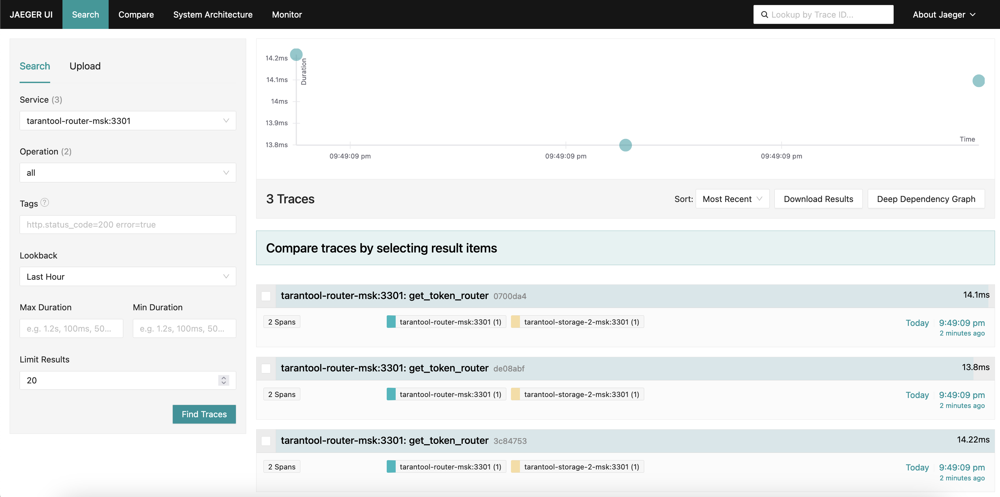
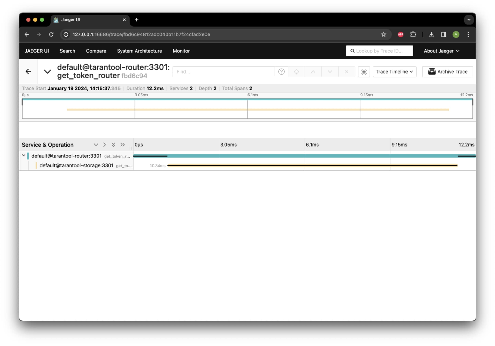

(user_guide-tracing_jaeger)=
# Трассировка с использованием Jaeger

В этом руководстве описано, как настроить трассировку функций, а также просмотреть и оценить результаты трассировки
в веб-интерфейсе [Jaeger](https://www.jaegertracing.io/).

Подробнее о модуле `tracing` можно узнать в разделе [Оценка производительности](/user_guide/troubleshooting/tracing.md).

Руководство включает следующие шаги:

* [](user_guide-tracing_jaeger-prereq)
* [](user_guide-tracing_jaeger-set_config)
* [](user_guide-tracing_jaeger-start_example)
* [](user_guide-tracing_jaeger-tracing_result)
* [](user_guide-tracing_jaeger-stop_example)

(user_guide-tracing_jaeger-prereq)=
## Пререквизиты

Для выполнения примера требуются следующие установленные компоненты:

* [Docker-образ](/install_and_upgrade/install/install_docker.md) Tarantool DB;
* приложение Docker compose;
* утилита [TT CLI](install-install_tt);
* сервис для сбора данных трассировки [Jaeger](https://www.jaegertracing.io/);
* исходные файлы примера `tracing`.
  Пример находится в директории `./doc/examples/tracing/`.
  Скачать архив с исходными файлами примера можно на [сайте Tarantool](https://tarantool.io/ru/tarantooldb/doc/latest/examples/tracing/tracing.tar.gz).

(user_guide-tracing_jaeger-set_config)=
## Определение конфигурации

В примере указаны следующие параметры трассировки:

```yaml
tracing:
  enabled: true
  global_sample_rate: 0
  sample_rates:
    get_token_router: 2
    debug_1: 1
  base_url: 'http://tracing:9411/api/v2/spans'
  api_method: 'POST'
  report_interval: 1
  spans_limit: 1000
```

Здесь:

* `enabled` -- включает трассировку;
* `global_sample_rate` -- глобальный коэффициент частоты трассировки запросов, при значении `0` запросы не трассируются;
* `sample_rates` -- коэффициенты частоты трассировки для заданных сегментов (spans);
* `base_url` -- URL-адрес сервера, куда отправляются данные трассировки;
* `api_method` -- HTTP-метод, который используется для отправки данных трассировки на сервер;
* `report_interval` -- интервал в секундах между отправкой данных трассировки на сервер;
* `spans_limit` -- максимальное количество сегментов (span) трассировки, которые могут быть сохранены локально
на экземпляре Tarantool перед отправкой во внешнюю систему хранения результатов трассировки.

По умолчанию сегменты (span) трассировки не засекают время выполнения участков кода.
Время выполнения участков кода засекается, если выполнено одно из следующих условий:

* В контексте указан параметр `sample: true`.
* Название родительского сегмента трассировки будет `get_token_router` или `debug_1`.
Вероятность замера времени для нового сегмента при этом будет равна 1/N (1/2 и 1 соответственно).

Параметры `tracing.base_url`, `tracing.api_method`, `tracing.report_interval` и tracing.`spans_limit` отвечают за
отправку результатов трассировки в сторонний сервис Jaeger.

Полное описание опций конфигурации `tracing` приведено в соответствующем разделе [Справочника по конфигурации](configuration_reference-tracing).

(user_guide-tracing_jaeger-start_example)=
## Запуск стенда и подключение к узлу

Перейдите в директорию примера `tracing`:

```
cd ./doc/examples/migrations/
```

Запустите стенд:

```shell
   docker compose up -d
```

Подключитесь к роутеру с помощью команды `tt connect`.
Команда открывает интерактивную консоль Tarantool, позволяющую работать с базой данных:

   ```shell
   tt connect admin:secret-cluster-cookie@localhost:3300
   ```

(user_guide-tracing_jaeger-tracing_result)=
## Оценка результатов трассировки

Запустите несколько тестовых функций на роутере:

```lua
for i = 1, 10 do
   box.func.get_token:call({"test"})
end
box.func.debug_func:call({"debug_1"})
box.func.debug_func:call({"debug_2"})
```

После этого зайдите в веб-интерфейс Jaeger на [http://127.0.0.1:16686](http://127.0.0.1:16686).
В поле `Service` выберите `default@tarantool-router:3301` и нажмите кнопку `Find Traces`.
В результате вы увидите примерно 5 результатов трассировки для функции `get_token()` и ровно 1 результат для функции `debug_func()` с сегментом `debug_1`.



Если открыть результат трассировки для функции `get_token()`, можно увидеть, что функция `get_token` выполняется примерно за 12 мс:

* 10 мс тратится на выполнение функции на экземпляре `storage`;
* еще по 1 мс тратится на коммуникацию экземпляров по сети до и после вызова функции на экземпляре `storage`.

Логика, выполняемая на экземпляре `storage`, занимает 80% времени, следовательно, оптимизацию кода следует начать с него.



(user_guide-tracing_jaeger-stop_example)=
## Остановка стенда

Чтобы остановить стенд, выполните следующую команду:

```shell
docker compose down
```
