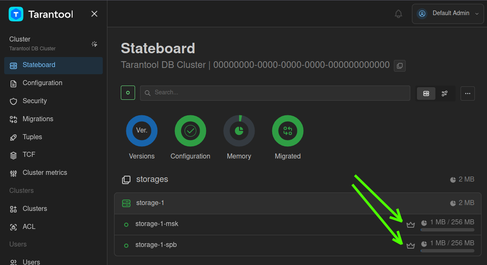
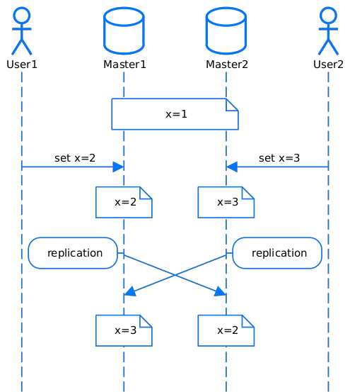
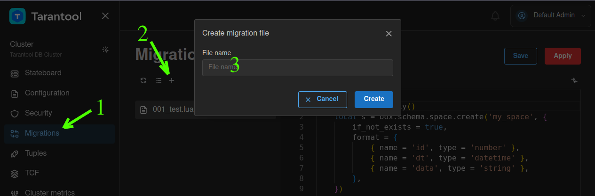

# Триггеры

В этом руководстве показано, как настроить [конфигурацию мастер-мастер](https://www.tarantool.io/ru/doc/latest/platform/replication/repl_architecture/#replication-roles-master-and-replica),
а также установить персистентный триггер для разрешения конфликта репликации.

> [!CAUTION]
> В Tarantool DB **не поддерживается** схема репликации мастер-мастер.
> Пример ниже приведен только в ознакомительных целях.
>
> В случае использования схемы мастер-мастер техническая поддержка **не оказывается** даже при наличии триггера
> на разрешение конфликта репликации. Узнать больше о существующих ограничениях в Tarantool DB
> можно в [соответствующем разделе документации](https://www.tarantool.io/docs/tdb/ru/3_x/install_and_upgrade/install/limitations).

Подробная информация о триггерах доступна в [документации Tarantool](https://www.tarantool.io/ru/doc/latest/platform/triggers/).

Содержание:

* [Пререквизиты](#пререквизиты)
* [Запуск стенда и подключение к узлам](#запуск-стенда-и-подключение-к-узлам)
* [Конфигурация мастер-мастер](#конфигурация-мастер-мастер)
* [Конфликт репликации мастер-мастер](#конфликт-репликации-мастер-мастер)
* [Реализация механизма разрешения конфликта репликации](#реализация-механизма-разрешения-конфликта-репликации)
* [Остановка стенда](#остановка-стенда)

## Пререквизиты

Для выполнения примера требуются:

* установленный [Docker-образ](https://www.tarantool.io/docs/tdb/ru/3_x/install_and_upgrade/install/install_docker) Tarantool DB;
* приложение Docker Compose;
* исходные файлы примера `triggers`.

> [!NOTE]
>  Есть два способа получить исходные файлы примера:
>  * Репозиторий [github.com/tarantool/tarantooldb-examples](https://github.com/tarantool/tarantooldb-examples/tree/release-3x/master).
>    Пример `triggers` расположен в директории `examples/triggers`.
>  * Отдельный архив [triggers.zip](https://download-directory.github.io/?url=https%3A%2F%2Fgithub.com%2Ftarantool%2Ftarantooldb-examples%2Ftree%2Frelease-3x%2Fmaster%2Fexamples%2Ftriggers&filename=triggers), скачанный из этого репозитория.

## Запуск стенда и подключение к узлам

Для успешного запуска должны быть свободны следующие порты:

* 2379
* 3301
* 3302
* 8081

Перейдите в папку с примером `triggers`:

```shell
cd examples/triggers
```

Запустите стенд:

```shell
make start
```

Команда развернет следующий стенд:
- кластер Tarantool DB, который состоит из одного набора реплик с двумя мастер-узлами;
- кластер etcd из 3 узлов;
- 1 узел [Tarantool Cluster Manager](https://www.tarantool.io/docs/tdb/ru/3_x/getting_started#getting_started-tcm) (TCM).

После запуска должны работать все контейнеры, кроме [init_host](../up_with_docker_compose/README.md#контейнер-init_host).

Также после запуска кластера становится доступен веб-интерфейс TCM.
Для входа в TCM откройте в браузере адрес [http://localhost:8081](http://localhost:8081).
Логин и пароль для входа:

- **Username**: `admin`
- **Password**: `secret`

## Конфигурация мастер-мастер

Обратите внимание, что в TCM на вкладке **Stateboard** в наборе реплик два мастера:


Выберите экземпляр кластера **storage-1-msk**. В открывшемся окне выберите
вкладку **Terminal**.

Во вкладке **Terminal** добавьте временную функцию `now()` для удобства ввода данных:
```lua
function now()
    local datetime = require('datetime')
    return datetime.now()
end
```

Откройте веб-интерфейс TCM во второй вкладке браузера. В TCM перейдите на вкладку **Stateboard** и выберите
второй экземпляр кластера `storage-1-spb`. В открывшемся окне перейдите на
вкладку **Terminal**
и добавьте туда временную функцию `now()`, описанную выше.

Теперь в браузере открыты две вкладки TCM (далее **TCM 1** и **TCM 2**) для работы с узлами кластера
`storage-1-msk` и `storage-1-spb` соответственно.

В TCM 1 во вкладке **Terminal** выполните следующую команду:
```lua
box.space.my_space:replace({1, now(), 'Too'})
```

Теперь в TCM 2 во вкладке **Terminal** выполните такую команду:
```lua
box.space.my_space:replace({2, now(), 'Foo'})
```

Чтобы просмотреть содержимое спейсов, выполните эту команду во вкладках **Terminal** в TCM 1 и TCM 2:
```lua
box.space.my_space:fselect()
```

Несмотря на то, что записи были вставлены на разных экземплярах, обе записи успешно добавлены в спейс:
```
---
- |-
  +-----+-----------------------------+-----+
  | id  |             dt              |data |
  +-----+-----------------------------+-----+
  |  1  |"2025-02-13T08:00:35.839119Z"|"Too"|
  |  2  |"2025-02-13T08:00:41.792330Z"|"Foo"|
  +-----+-----------------------------+-----+
...
```

## Конфликт репликации мастер-мастер

Если набор реплик работает в режиме мастер-мастер, одновременная
запись по одному и тому же первичному ключу с разных экземпляров кластера
приводит к конфликту репликации: в наборе реплик у записи с этим первичным ключом возникают две версии текущего значения.
Длительность окна, в течение которого запись в два узла считается одновременной, определяется скоростью репликации между этими узлами и
зависит от сетевых задержек. В общем случае речь идёт о нескольких
миллисекундах.



Рекомендуется использовать одно из решений ниже:
* использовать коммутативные операции;
* реализовать механизм разрешения конфликта репликации.

Кроме того, в системах с репликацией мастер-мастер по описанным выше причинам нельзя использовать
автоинкремент в индексах. Используйте вместо этого значения типа `UID`.

Подробнее о конфликтах репликации читайте в [документации Tarantool](https://www.tarantool.io/en/doc/latest/admin/replication/repl_problem_solving/).

Поскольку воспроизвести одновременную запись в оба узла сложно, в примере для демонстрации конфликта репликации
мастер-мастер будет специальным образом нарушен процесс репликации.

Выполните во вкладках **Terminal** в TCM 1 и TCM 2 следующие команды:
```lua
replication_bak = box.cfg.replication
box.cfg({replication = {}})
```

Добавьте в TCM 1 во вкладке **Terminal** такую запись:
```lua
box.space.my_space:replace({3, now(), 'AAAA'})
```

В TCM 2 во вкладке **Terminal** вставьте следующую запись:
```lua
box.space.my_space:replace({3, now(), 'BBBB'})
```

Чтобы восстановить процесс репликации, выполните команду на обоих узлах (во вкладках **Terminal** в TCM 1 и TCM 2):
```lua
box.cfg({replication = replication_bak})
```

Чтобы просмотреть содержимое спейсов, выполните эту команду во вкладках **Terminal** в TCM 1 и TCM 2:
```lua
box.space.my_space:fselect()
```

На первом экземпляре вывод будет выглядеть так:
```
---
- |-
  +-----+-----------------------------+------+
  | id  |             dt              | data |
  +-----+-----------------------------+------+
  |  1  |"2025-02-13T08:00:35.839119Z"|"Too" |
  |  2  |"2025-02-13T08:00:41.792330Z"|"Foo" |
  |  3  |"2025-02-13T08:12:34.279904Z"|"BBBB"|
  +-----+-----------------------------+------+
...
```

На втором экземпляре вывод будет следующий:
```
---
- |-
  +-----+-----------------------------+------+
  | id  |             dt              | data |
  +-----+-----------------------------+------+
  |  1  |"2025-02-13T08:00:35.839119Z"|"Too" |
  |  2  |"2025-02-13T08:00:41.792330Z"|"Foo" |
  |  3  |"2025-02-13T08:12:27.939872Z"|"AAAA"|
  +-----+-----------------------------+------+
...
```

Видно, что данные не согласованы, и каждый экземпляр кластера имеет
свою версию данных.

## Реализация механизма разрешения конфликта репликации

Строгого критерия, однозначно определяющего порядок, в
котором были сделаны записи в кластер, не существует. Это означает, что критерий нужно выбирать персонально для каждого
приложения. Виды критериев:
- временные метки. Временные метки имеют свои недостатки, в том числе разность времени между серверами и високосные секунды;
- критерии, характерные для данных конкретного спейса.

В этом примере в качестве критерия используется временная метка. Логику разрешения конфликта будет выполнять
триггер перед записью в спейс.

Откройте веб-интерфейс TCM в третьей вкладке браузера. Далее:
1. В левом меню выберите вкладку **Migrations**.
2. Нажмите `+`, чтобы добавить новую миграцию.
3. Добавьте новую миграцию с названием `002_test.lua`.

   

4. Скопируйте в поле ввода код миграции `002_test.lua`:

    ```lua
    local function apply()
        -- Описана логика работы триггера
        local body = [[
            function (old_tuple, new_tuple, space_name, operation_name)
                if old_tuple and new_tuple then
                    -- Индекс 2 соответствует полю dt
                    if old_tuple[2] < new_tuple[2] then
                        return new_tuple
                    end
                else
                    return new_tuple
                end

                return old_tuple
            end
        ]]

        -- Объявлен персистентный триггер
        box.schema.func.create('example.replicated_trigger', {
            body = body,
            trigger = 'box.space.my_space.before_replace'
        })

        return true
    end

    -- Стандартный блок возврата для модулей миграции
    return {
        apply = {
            scenario = apply,
        }
    }
    ```

5. Нажмите кнопки **Save** и **Apply**, чтобы сохранить и применить добавленную миграцию. В этой миграции был добавлен триггер, который будет продолжать работать после перезапуска экземпляров.

Обратите внимание, что для нескольких спейсов можно указывать один триггер:

```lua
box.schema.func.create('example.replicated_trigger', {
       body = body,
       trigger = {
         'box.space.my_space1.before_replace', -- < --
         'box.space.my_space2.before_replace', -- < --
       }
})
```

## Проверка работы триггера

Чтобы снова нарушить репликацию, выполните следующие команды
на обоих узлах (во вкладках **Terminal** в TCM 1 и TCM 2):
```lua
replication_bak = box.cfg.replication
box.cfg({replication = {}})
```

На первом узле, во вкладке **Terminal** в TCM 1, добавьте такую запись:
```lua
box.space.my_space:replace({4, now(), 'CCCC'})
```

На втором узле, во вкладке **Terminal** в TCM 2, добавьте следующую запись:
```lua
box.space.my_space:replace({4, now(), 'DDDD'})
```

Чтобы включить репликацию, выполните команду на обоих узлах:
```lua
box.cfg({replication = replication_bak})
```

Чтобы просмотреть содержимое спейсов, выполните эту команду на обоих узлах:
```lua
box.space.my_space:fselect()
```

Четвёртая строка будет одинаковой везде, потому что сработал триггер, оставивший из двух версий более свежую:
```
---
- |-
  +-----+-----------------------------+------+
  | id  |             dt              | data |
  +-----+-----------------------------+------+
  |  1  |"2025-02-13T08:00:35.839119Z"|"Too" |
  |  2  |"2025-02-13T08:00:41.792330Z"|"Foo" |
  |  3  |"2025-02-13T08:12:34.279904Z"|"BBBB"|
  |  4  |"2025-02-13T08:56:01.204955Z"|"DDDD"|
  +-----+-----------------------------+------+
...
```

## Остановка стенда

Для остановки стенда в терминале ОС выполните следующую команду:

```shell
make stop
```
