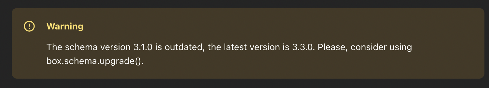

# Обновление схемы через tt CLI

В этом руководстве показано, как обновить схему Tarantool DB с помощью утилиты tt CLI.


## Пререквизиты

Для выполнения примера требуются:

* установленные [Docker-образы](https://www.tarantool.io/docs/tdb/ru/3_x/install_and_upgrade/install/install_docker) Tarantool DB, Prometheus и Grafana;
* приложение Docker Compose;
* исходные файлы примера `tt_schema_upgrade`.

> [!NOTE]
>  Есть два способа получить исходные файлы примера:
>  * Репозиторий [github.com/tarantool/tarantooldb-examples](https://github.com/tarantool/tarantooldb-examples/tree/release-3x/master).
>    Пример `tt_schema_upgrade` расположен в директории `examples/tt_schema_upgrade`.
>  * Отдельный архив [tt_schema_upgrade.zip](https://download-directory.github.io/?url=https%3A%2F%2Fgithub.com%2Ftarantool%2Ftarantooldb-examples%2Ftree%2Frelease-3x%2Fmaster%2Fexamples%2Ftt_schema_upgrade&filename=tt_schema_upgrade), скачанный из этого репозитория.

## Запуск стенда

Перейдите в директорию примера `tt_schema_upgrade`:

```shell
cd examples/tt_schema_upgrade
```

Запустите кластер Tarantool DB:

```shell
make start
```

Запущенный стенд состоит из:

- кластера Tarantool DB:
  - 2 роутера;
  - 2 набора реплик по 3 хранилища;
  - 1 [Tarantool Cluster Manager](https://www.tarantool.io/docs/tdb/ru/3_x/getting_started#getting_started-tcm) (TCM);
- кластера etcd из 3 узлов.

После запуска должны работать все контейнеры, кроме [init_host](../up_with_docker_compose/README.md#контейнер-init_host).
Также после запуска становится доступен веб-интерфейс TCM.

Для входа в TCM откройте в браузере адрес [http://localhost:8081](http://localhost:8081).
Логин и пароль для входа:

- **Username**: `admin`
- **Password**: `secret`

В TCM откройте вкладку **Stateboard**.

В кластере появится предупреждение о необходимости обновить схему БД:


## Обновление схемы

Чтобы обновить схему через tt CLI, используйте команду `tt replicaset upgrade`.
Для этого:

1. Зайдите в контейнер `tarantool-router-msk`:

   ```shell
   docker exec  -it cluster-tarantool-router-msk-1 /bin/bash
   ```

2. Последовательно обновите схемы на нужных наборах реплик:

    ```shell
      tt replicaset upgrade admin:secret-cluster-cookie@tarantool-router-msk:3301
      tt replicaset upgrade admin:secret-cluster-cookie@tarantool-router-spb:3301
      tt replicaset upgrade admin:secret-cluster-cookie@tarantool-storage-1-msk:3301
      tt replicaset upgrade admin:secret-cluster-cookie@tarantool-storage-2-msk:3301
    ```

В параметрах команды можно указать адрес любого экземпляра в наборе реплик.
Предупреждение об устаревшей схеме БД пропадет после успешного обновления схемы.

Обновление схемы также будет отражено в логах:

```
tarantool-router-msk-1  | 2025-10-09 08:44:55.876 [1] main/104/interactive/box.upgrade upgrade.lua:1591 I> Recovering snapshot with schema version 3.1.0
tarantool-router-msk-1  | 2025-10-09 08:44:55.901 [1] main/104/interactive/box.load_cfg load_cfg.lua:1229 W> Your schema version is 3.1.0 while Tarantool 3.4.0-0-gea61d3a20 requires a more recent schema version. Please, consider using box.schema.upgrade().
tarantool-router-msk-1  | 2025-10-09 08:44:55.928 [1] main/104/interactive/tarantool.config log.lua:74 W> The schema version 3.1.0 is outdated, the latest version is 3.3.0. Please, consider using box.schema.upgrade().
tarantool-router-msk-1  | 2025-10-09 08:44:55.928 [1] main/129/box.watcher/tarantool.config log.lua:74 W> The schema version 3.1.0 is outdated, the latest version is 3.3.0. Please, consider using box.schema.upgrade().
tarantool-router-msk-1  | 2025-10-09 08:46:10.299 [1] main/180/tt_migrations.executor/box.upgrade upgrade.lua:1632 I> set schema version to 3.3.0
```

Проверить, что схема успешно обновлена, можно с помощью вызова `box.info.schema_version`. После обновления схемы значение `schema_version` увеличится.

## Остановка стенда

Остановить стенд можно так:

```shell
make stop
```
