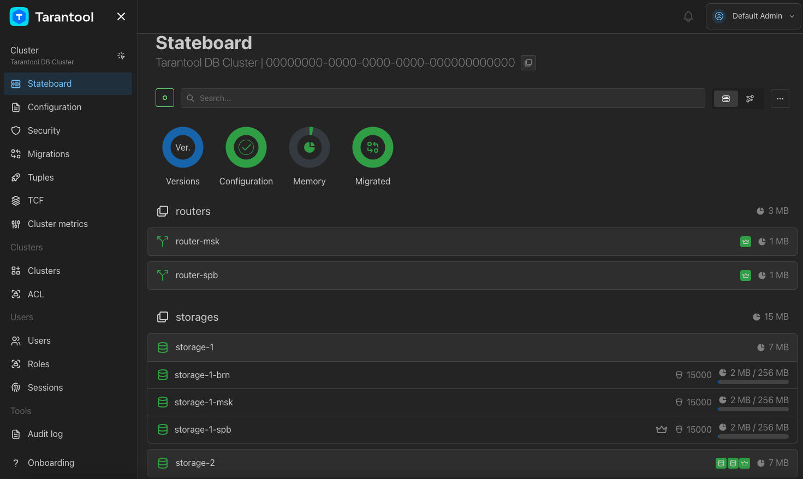

# Запуск кластера через Docker Compose

В этом руководстве показано, как запустить кластер Tarantool DB с помощью Docker Compose.

> [!NOTE]
> Развертывание Tarantool DB через Docker-образ используется в ознакомительных целях и
> рассчитано для использования в примерах документации и при тестировании.
> Для целевого развертывания используйте [Ansible Tarantool Enterprise](https://www.tarantool.io/docs/tdb/ru/3_x/install_and_upgrade/install/install_ate#install_guide-ate).

Содержание:

* [Пререквизиты](#пререквизиты)
* [Запуск стенда](#запуск-стенда)
* [Используемые файлы](#используемые-файлы)
* [Конфигурация контейнера для узла Tarantool DB](#конфигурация-контейнера-для-узла-tarantool-db)
* [Контейнер init_host](#контейнер-init_host)
* [Остановка стенда](#остановка-стенда)

## Пререквизиты

Для выполнения примера требуются:

* установленные [Docker-образы](https://www.tarantool.io/docs/tdb/ru/3_x/install_and_upgrade/install/install_docker) Tarantool DB, Prometheus и Grafana;
* приложение Docker Compose;
* исходные файлы примера `up_with_docker_compose`.

> [!NOTE]
>  Есть два способа получить исходные файлы примера:
>  * Репозиторий [github.com/tarantool/tarantooldb-examples](https://github.com/tarantool/tarantooldb-examples/tree/release-3x/master).
>    Пример `up_with_docker_compose` расположен в директории `examples/up_with_docker_compose`.
>  * Отдельный архив [up_with_docker_compose.zip](https://download-directory.github.io/?url=https%3A%2F%2Fgithub.com%2Ftarantool%2Ftarantooldb-examples%2Ftree%2Frelease-3x%2Fmaster%2Fexamples%2Fup_with_docker_compose&filename=up_with_docker_compose), скачанный из этого репозитория.

## Запуск стенда

Перейдите в директорию примера `up_with_docker_compose`:

```shell
cd examples/up_with_docker_compose
```

Запустите кластер Tarantool DB:

```shell
make start
```

Команда последовательно выполняет следующие шаги:
1. Запускает централизованное хранилище конфигурации — кластер etcd;
2. Загружает конфигурацию кластера в централизованное хранилище;
3. Запускает кластер Tarantool DB;
4. Загружает миграции в кластер и выполняет их.

Запущенный стенд состоит из:

- кластера Tarantool DB:
  - 2 роутера;
  - 2 набора реплик по 3 хранилища;
  - 1 [Tarantool Cluster Manager](https://www.tarantool.io/docs/tdb/ru/3_x/getting_started#getting_started-tcm) (TCM);
- кластера etcd из 3 узлов;
- средств мониторинга ([Prometheus](https://prometheus.io/), [Grafana](https://grafana.com/)).

После запуска должны работать все контейнеры, кроме [init_host](#контейнер-init_host).
Также после запуска доступны следующие пользовательские интерфейсы:
* http://localhost:8081 — веб-интерфейс TCM;
* http://localhost:9090 — веб-интерфейс Prometheus;
* http://localhost:3000 — веб-интерфейс Grafana.

Для входа в веб-интерфейс TCM откройте в браузере адрес [http://localhost:8081](http://localhost:8081).
Логин и пароль для входа:

- **Username**: `admin`
- **Password**: `secret`

В TCM откройте вкладку **Stateboard**.
После применения настроек кластер будет выглядеть так:



## Используемые файлы

В руководстве используются следующие файлы примера `up_with_docker_compose`:

* `cluster/` — директория c файлами для запуска кластера Tarantool DB:
  * `config.yml` — конфигурация и топология кластера;
  * `docker-compose.yml` — описание узлов кластера Tarantool DB;
  * `migrations/scenario` — директория, содержащая файлы с описанием миграций;
* `tools/` — директория с файлами для запуска кластера etcd и средств мониторинга:
  * `grafana/` — директория, содержащая настройки для ведения мониторинга;
  * `prometheus/` — директория, содержащая настройки Prometheus для сбора и передачи метрик в Grafana;
  * `docker-compose.yml` — описание узлов кластера etcd и средств мониторинга;
  * `tcm.yml` — конфигурация для запуска [Tarantool Cluster Manager](https://www.tarantool.io/ru/doc/latest/reference/tooling/tcm/);
* `Makefile` — инструкции для утилиты `make` для запуска и остановки всего стенда.

## Конфигурация контейнера для узла Tarantool DB

Конфигурация контейнера для узла Tarantool DB задается в файле `docker-compose.yml`:

```yaml
tarantool-router-msk:
  image: tarantooldb:3x-latest
  networks:
    - tarantooldb_network
  ports:
    - "3301:3301"
  environment:
    - TT_INSTANCE_NAME=router-msk
    - TT_CONFIG_ETCD_ENDPOINTS=http://etcd1:2379,http://etcd2:2379,http://etcd3:2379
    - TT_CONFIG_ETCD_PREFIX=/tdb
    - TT_CONFIG_ETCD_HTTP_REQUEST_TIMEOUT=3
```

Здесь:
* `image` —  название Docker-образа, используемого для создания контейнера;
* `networks` — название подсети;
* `ports` — используемые порты;
* `environment` — переменные окружения для опций Tarantool:
  * `TT_INSTANCE_NAME` — имя экземпляра в кластере;
  * `TT_CONFIG_ETCD_ENDPOINTS` — адреса централизованного хранилища конфигурации;
  * `TT_CONFIG_ETCD_PREFIX` — адрес данных кластера Tarantool DB в централизованном хранилище конфигурации;
  * `TT_CONFIG_ETCD_HTTP_REQUEST_TIMEOUT` — таймаут запроса для получения конфигурации.

  Полный список опций доступен в описании [Docker-образа](https://www.tarantool.io/docs/tdb/ru/3_x/install_and_upgrade/install/install_docker/docker-image-description#install_docker-image-description) Tarantool DB.

## Контейнер init_host

В файле `cluster/docker-compose.yml` есть специальный контейнер `init_host`.
С этого контейнера выполняются:

1. Загрузка клиентского кода (миграций) в кластер и его применение: описание спейсов и функций.
2. Добавление кластера в веб-интерфейс.

## Остановка стенда

Остановить стенд можно так:

```shell
make stop
```
